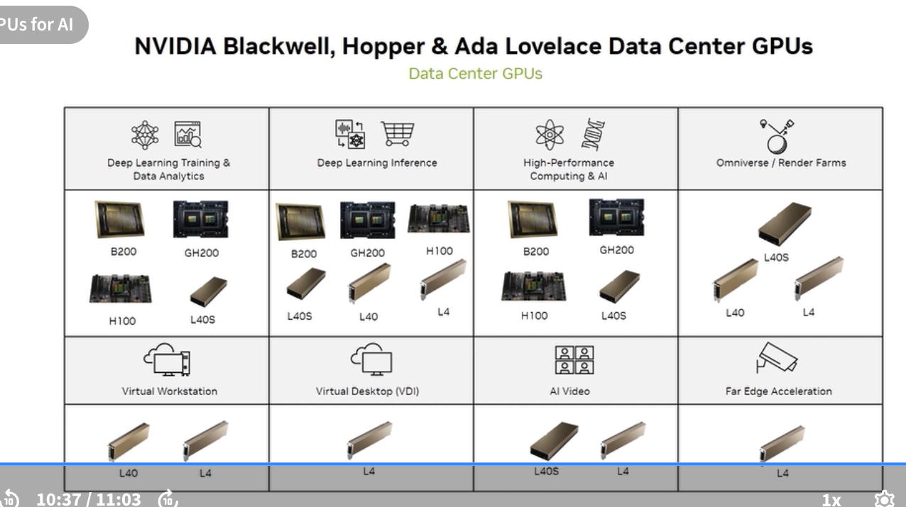

# 1.6 NVIDIA Solutions: Purpose and Use Cases

## What the exam tests

Which GPU/system/software is the right fit for a given workload. The exam frequently presents a scenario and asks which NVIDIA product family addresses it.

---

## GPU families and their workloads

### Blackwell / Blackwell Ultra (B200, B300)

- **Primary use:** Generative AI, AI reasoning, LLM training, LLM inference, Biology/AI drug discovery
- **Architecture highlights:**
  - 208 billion transistors
  - 2nd-generation Transformer Engine (FP4/FP8/FP16/BF16)
  - 5th-generation NVLink (1.8 TB/s bidirectional per GPU)
  - HBM3e high bandwidth memory
  - Secure AI enclave
  - Hardware decompression engine

**Key message:** B200/B300 is "the engine of the new industrial revolution" — NVIDIA's positioning for the biggest generative AI training and inference jobs.

---

### Hopper (H100, H200)

- **Primary use:** Large language models, data analytics, conversational AI, image creation, natural language processing, autonomous vehicles
- **Key specs (H100 SXM5):**
  - 80 GB HBM3 (H100) / 141 GB HBM3e (H200)
  - 3.35 TB/s memory bandwidth (H100) / 4.8 TB/s (H200)
  - 4th-gen Tensor Cores with FP8 support
  - 4th-gen NVLink (900 GB/s)
  - Transformer Engine (auto-switches FP8/FP16 per layer)
  - Confidential Computing support

---

### Ada Lovelace (L40S, L40, L4)

- **Primary use:** Generative AI inference + graphics in one GPU; AI video, premium visualization, mainstream data center compute, VDI/VPC
- **Key specs (L40S):**
  - 48 GB GDDR6 (not HBM — lower bandwidth but sufficient for inference + compute)
  - 4th-gen Tensor Cores, 5th-gen RT Cores
  - Advanced video acceleration (AV1 encode/decode)
  - Data center scalability, security, power efficiency

**Differentiator vs Hopper:** L40S is the *do-it-all* card — handles both AI inference and rendering workloads on a single GPU. H100 is purely for compute.

---

### Grace CPU

- **Primary use:** HPC, cloud computing, hyperscale data centers
- **Architecture:**
  - Arm-based (72 Arm Neoverse V2 cores)
  - NVIDIA proprietary memory subsystem
  - Highly scalable and energy efficient
  - Supports large amounts of memory and bandwidth (LPDDR5X)
- **Role:** Building block for Grace Superchips (GH200, GB200); enables tight CPU↔GPU integration via NVLink-C2C

---

### Data center GPU use-case matrix

This matrix shows which GPUs NVIDIA recommends per workload:

| Workload | Recommended GPUs |
|---|---|
| Deep Learning Training & Data Analytics | B200, GH200, H100, L40S |
| Deep Learning Inference | B200, GH200, H100, L40S, L40, L4 |
| HPC & Scientific Computing & AI | B200, GH200, H100, L40S |
| Omniverse / Render Farms | L40S |
| Virtual Workstation | L40 |
| Virtual Desktop (VDI) | L4 |
| AI Video | L40S, L4 |
| Far Edge Acceleration | L4 |

---

## RTX PRO Server

- **Product:** NVIDIA RTX PRO 6000 Blackwell Server Edition GPU
- **Purpose:** Most powerful Blackwell data center platform for AI *and* visual computing
- **Key specs:**
  - 24,064 CUDA parallel processing cores
  - 752 5th-gen Tensor Cores
  - 188 4th-gen RT Cores

Targets workloads that need both AI acceleration and photorealistic rendering in a data center environment (e.g., engineering simulation, digital twin).

---

## Self-check questions

1. Which GPU family is described as "the engine of the new industrial revolution" for generative AI?
2. An enterprise needs a single GPU for LLM inference AND professional visualization. Which family fits?
3. What unique feature does the Blackwell architecture add compared to Hopper's Transformer Engine?
4. Which NVIDIA GPU is recommended for VDI (Virtual Desktop Infrastructure)?
5. How many transistors does the B200 GPU contain?

Answers

1. Blackwell / Blackwell Ultra (B200, B300) 
2. Ada Lovelace (L40S) 
3. Second-generation Transformer Engine with FP4 support (Hopper had first-gen, supporting FP8) 
4. L4 (for VDI); L40 for Virtual Workstation 
5. 208 billion transistors

