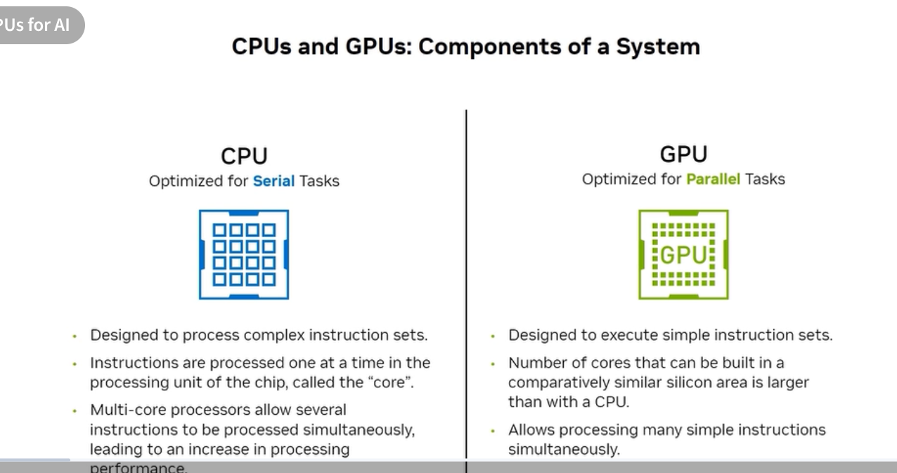
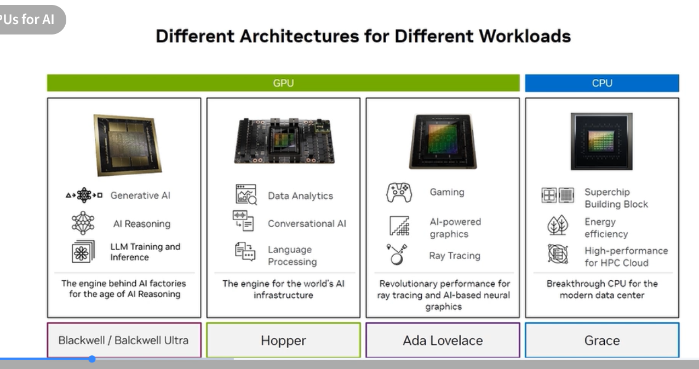

# 1.8 GPU vs CPU Architecture

## What the exam tests

The key distinction between serial and parallel processing, why GPUs dominate AI workloads, and how NVIDIA's architecture families (Blackwell, Hopper, Ada Lovelace, Grace) map to specific workload types.

---

## CPU vs GPU: the core difference

| | CPU | GPU |
|---|---|---|
| Optimized for | **Serial tasks** | **Parallel tasks** |
| Core design | Few powerful cores (4–128) | Thousands of simpler cores |
| Instruction model | Complex instruction sets | Simple, repeated instructions |
| Memory model | Large cache hierarchy, low latency | High bandwidth, many threads hide latency |
| Typical use | OS, databases, business logic | Matrix math, convolutions, rendering |

**Why this matters for AI:** Neural network training and inference are dominated by matrix multiplications (GEMM operations). A single forward pass of a large transformer executes billions of multiply-accumulate operations simultaneously — exactly what a GPU's massively parallel architecture is built for. A CPU would serialize those operations, making training prohibitively slow.

---

## Different architectures for different workloads

NVIDIA maintains four distinct processor architectures, each targeting a different segment:

| Architecture | Product | Primary workload |
|---|---|---|
| **Blackwell / Blackwell Ultra** | B200, B300 | Generative AI, AI reasoning, LLM training & inference — *engine of the AI Factory* |
| **Hopper** | H100, H200 | Data analytics, conversational AI, language processing — *engine for world's AI infrastructure* |
| **Ada Lovelace** | L40S, L40, L4 | Gaming, AI-powered graphics, ray tracing, premium rendering |
| **Grace** | Grace CPU | Superchip building block, energy efficiency, HPC cloud |

**Exam trap:** Ada Lovelace (L40S) is often tested as the GPU for *inference + graphics combined* in a data center context — it handles both generative AI inference and professional visualization, making it suitable for VDI and AI video workloads that a pure HPC GPU like H100 is not designed for.

---

## Key GPU architectural features to know

### Tensor Cores
Specialized matrix-math accelerators built into NVIDIA GPU SMs (Streaming Multiprocessors). Each generation increases throughput and adds new precision formats:

| Generation | GPU | Supported precisions |
|---|---|---|
| 1st | Volta (V100) | FP16 |
| 2nd | Turing (T4) | FP16, INT8, INT4 |
| 3rd | Ampere (A100) | FP16, BF16, TF32, INT8, FP64 |
| 4th | Hopper (H100), Ada (L40S) | FP8 added |
| 5th | Blackwell (B200) | FP4 added, 2nd-gen Transformer Engine |

### CUDA Cores
General-purpose shader processors. Each SM contains many CUDA cores plus a few Tensor Cores. CUDA cores handle non-matrix workloads (memory operations, activation functions, etc.).

### High Bandwidth Memory (HBM)
Stacked DRAM mounted directly on the GPU package. Provides far higher memory bandwidth than GDDR:

- H100 SXM: **3.35 TB/s** bandwidth (HBM3)
- B200: **8 TB/s** bandwidth (HBM3e) — more than double

For LLM inference, memory bandwidth is often the bottleneck (loading model weights per token), making HBM bandwidth a critical spec.

### NVLink (chip-to-chip)
High-speed direct GPU interconnect. Used both within a system (GPU↔GPU) and in Superchips (CPU↔GPU). Each generation increases bandwidth:

- NVLink 3 (Ampere): 600 GB/s bidirectional
- NVLink 4 (Hopper): 900 GB/s bidirectional
- NVLink 5 (Blackwell): 1.8 TB/s bidirectional

---

## Self-check questions

1. A CPU is optimized for \_\_\_ tasks; a GPU is optimized for \_\_\_ tasks.
2. Which NVIDIA GPU architecture is called "the engine for the world's AI infrastructure"?
3. What type of memory provides the highest bandwidth in NVIDIA data-center GPUs?
4. An engineer needs a single GPU that handles both LLM inference and professional graphics rendering in a data center. Which family fits?
5. What is the purpose of Tensor Cores vs CUDA Cores?

Answers

1. Serial; Parallel 
2. Hopper (H100) 
3. HBM (High Bandwidth Memory) 
4. Ada Lovelace (L40S) 
5. Tensor Cores are specialized for matrix multiply-accumulate (GEMM) — the core of deep learning. CUDA Cores handle general parallel compute tasks.

