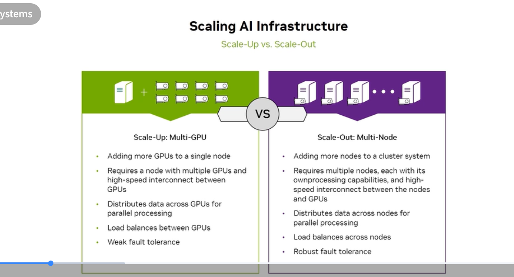
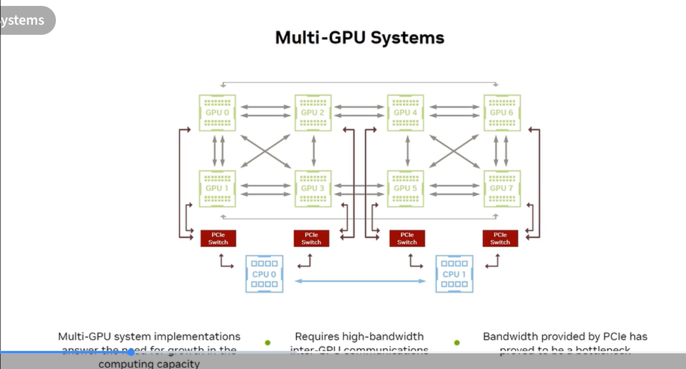
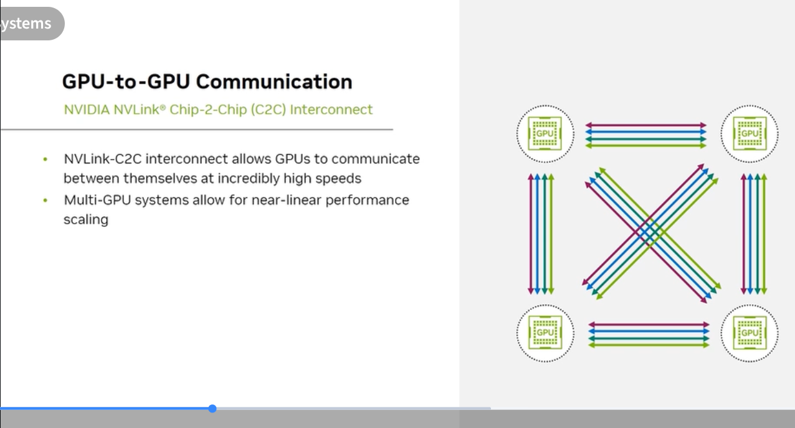
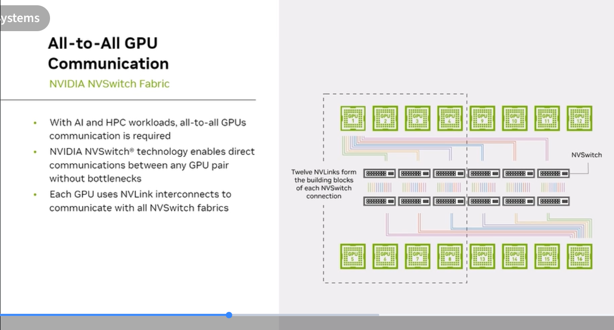
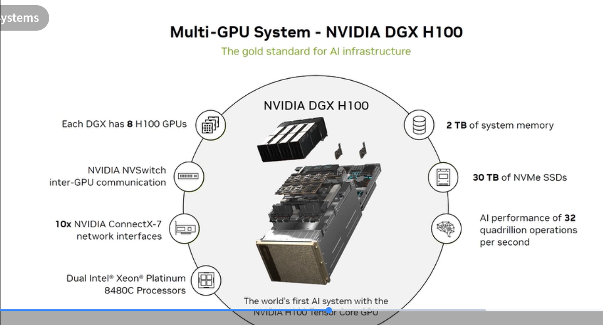
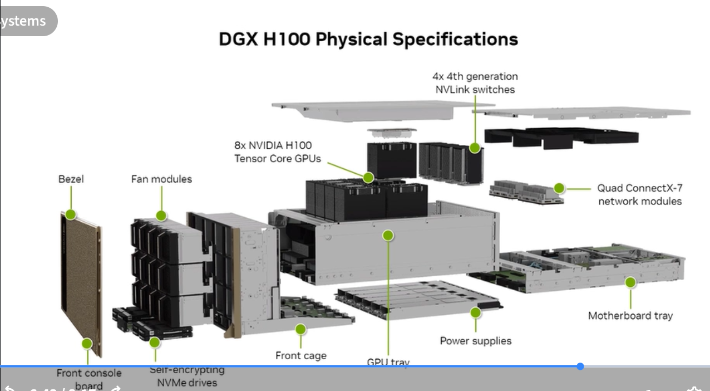

# 2.2 Scaling GPU Infrastructure

## What the exam tests

Scale-up vs scale-out strategies, NVLink, NVSwitch, and how NVIDIA's multi-GPU interconnect technology enables linear performance scaling.

---

## Scale-Up vs Scale-Out



| | Scale-Up (Multi-GPU) | Scale-Out (Multi-Node) |
|---|---|---|
| **Definition** | Add more GPUs to a single server | Add more servers to a cluster |
| **Interconnect** | NVLink / NVSwitch (within server) | InfiniBand / Ethernet (between servers) |
| **Communication** | Very high bandwidth (900 GB/s – 1.8 TB/s) | Lower bandwidth (400 – 800 Gbps) |
| **Latency** | Sub-microsecond | Microseconds |
| **Load balancing** | Between GPUs in node | Between nodes |
| **Fault tolerance** | **Weak** — single server failure loses all GPUs | **Robust** — one node failure affects only part of cluster |
| **Use case** | Models that fit within one node; latency-sensitive | Models too large for one node; maximum scale |

**Exam tip:** These are not mutually exclusive — production AI clusters use both: scale-up within each DGX node, scale-out across nodes via InfiniBand.

---

## Multi-GPU Systems: the PCIe bottleneck



Early multi-GPU systems used PCIe switches to connect GPUs. The problem:
- PCIe Gen4 x16 provides ~64 GB/s bidirectional bandwidth
- Neural network layers exchange large activation tensors between GPUs
- PCIe bandwidth became the bottleneck — GPUs spent more time waiting for data than computing
- Multi-GPU system implementations **require** high-bandwidth inter-GPU communications

This is why NVIDIA developed NVLink — to eliminate the PCIe interconnect bottleneck for GPU-to-GPU communication.

---

## NVLink: GPU-to-GPU Communication



**NVLink** is NVIDIA's proprietary high-speed GPU interconnect. It replaces PCIe for GPU-to-GPU transfers.

- **NVLink-C2C (Chip-to-Chip):** Direct die-to-die connection, used inside Superchips (Grace↔GPU)
- **NVLink 4 (Hopper):** 900 GB/s total bidirectional bandwidth per GPU
- **NVLink 5 (Blackwell):** 1.8 TB/s total bidirectional bandwidth per GPU
- **Coherent memory:** Applications see GPU and CPU memory as a unified address space (in Superchip configurations)
- **Near-linear performance scaling:** Adding GPUs connected via NVLink scales performance almost linearly because bandwidth isn't the bottleneck

### NVLink generations

| Generation | GPU | Total BW per GPU | Key feature |
|---|---|---|---|
| NVLink 2 | V100 | 300 GB/s | First mainstream NVLink |
| NVLink 3 | A100 | 600 GB/s | SXM4 package |
| NVLink 4 | H100 | 900 GB/s | C2C for GH200 |
| NVLink 5 | B200 | 1.8 TB/s | 5th gen in GB300 NVL72 |

---

## NVSwitch: All-to-All GPU Communication



**NVSwitch** is a dedicated silicon switch that creates a fully non-blocking, all-to-all NVLink fabric across all GPUs in a system.

- Without NVSwitch: GPUs connect peer-to-peer via limited NVLink ports — not all pairs can communicate simultaneously
- **With NVSwitch:** Any GPU can communicate with any other GPU at full bandwidth simultaneously — true all-to-all
- **DGX H100 uses 4× NVSwitch chips** to create the 8-GPU all-to-all fabric
- Each GPU uses its NVLink ports to connect to the NVSwitch, which routes traffic between GPUs

### Why all-to-all matters for AI
AI/HPC workloads require collective operations: all-reduce (gradient sync), all-gather (parameter distribution), reduce-scatter. These operations require every GPU to exchange data with every other GPU simultaneously. NVSwitch enables this at full NVLink bandwidth — no congestion, no bottlenecks.

```
              NVSwitch (x4 in DGX H100)
                  /  |  |  |  \
    GPU0 --- GPU1 --- GPU2 --- GPU3
     |               |               |
    GPU4 --- GPU5 --- GPU6 --- GPU7
    
    Each GPU: full NVLink bandwidth to ALL other GPUs simultaneously
```

---

## DGX H100: Scale-Up in Practice




The DGX H100 is NVIDIA's reference AI training system. Key specs:
- **8× H100 SXM5 80GB** Tensor Core GPUs
- **4× NVSwitch** for 900 GB/s all-to-all GPU interconnect
- **2 TB** system memory
- **30 TB** NVMe SSDs (local, high-speed model checkpointing)
- **8× ConnectX-7 400Gbps InfiniBand** NICs (scale-out to other DGX nodes)
- **2× Intel Xeon Platinum 8480C** CPUs
- AI performance: **32 quadrillion operations per second**

Physical design: 10U rack server with dedicated front-panel, fan modules, NVLink switches, power supplies, and ConnectX-7 network modules.

---

## Self-check questions

1. What is the main trade-off between scale-up and scale-out?
2. Why did PCIe become a bottleneck for multi-GPU systems before NVLink?
3. How much total NVLink bandwidth does each H100 GPU have?
4. What problem does NVSwitch solve that simple NVLink peer-to-peer connections cannot?
5. How many NVSwitch chips does the DGX H100 contain?

<details>
<summary>Answers</summary>
1. Scale-up: very high bandwidth (NVLink), sub-microsecond latency, but limited by server size and weak fault tolerance. Scale-out: robust fault tolerance, near-infinite scale, but lower inter-node bandwidth and higher latency.<br>
2. PCIe bandwidth (~64 GB/s per slot) is far lower than the data exchange rates needed between GPUs for neural network operations. GPUs stalled waiting for data, preventing efficient parallel compute.<br>
3. 900 GB/s bidirectional (NVLink 4, Hopper) — Blackwell (NVLink 5) increases this to 1.8 TB/s.<br>
4. NVSwitch enables any-to-any full-bandwidth communication simultaneously. Without it, a GPU can only connect to its directly linked peers via NVLink. NVSwitch creates a non-blocking crossbar so all 8 GPUs in a DGX can exchange data with all others at the same time without contention.<br>
5. 4× NVSwitch chips.
</details>
