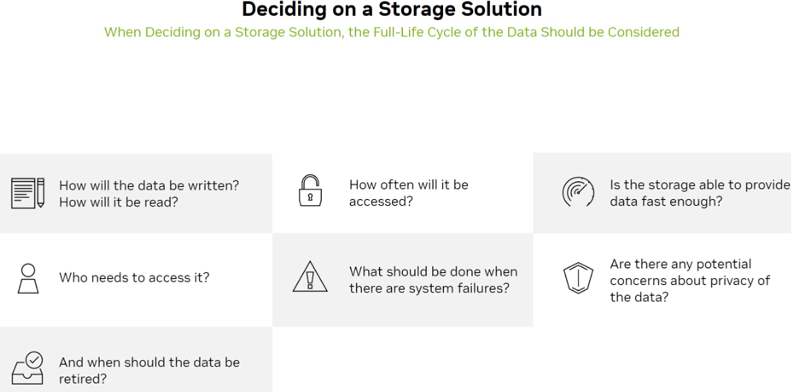
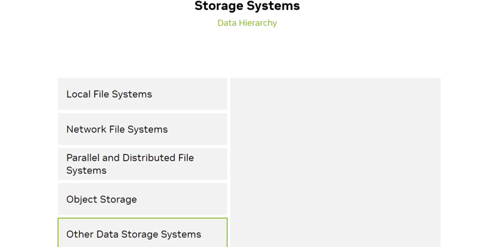
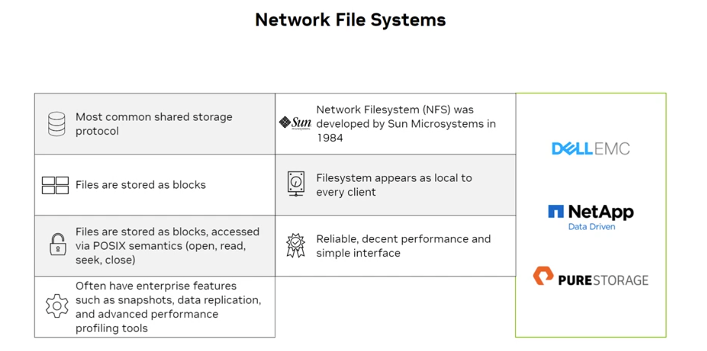

# 2.5 Cluster Components of Accelerated Infrastructure

## What the exam tests

The major hardware components of an AI cluster — compute nodes (DGX systems), storage hierarchy, networking, and how they connect.

---

## AI cluster architecture overview

```
┌─────────────────────────────────────────────────────────────────┐
│                     AI CLUSTER                                   │
│                                                                  │
│  ┌──────────┐  ┌──────────┐  ┌──────────┐  ┌──────────┐        │
│  │ DGX Node │  │ DGX Node │  │ DGX Node │  │ DGX Node │  ...   │
│  │ 8× GPU   │  │ 8× GPU   │  │ 8× GPU   │  │ 8× GPU   │        │
│  └────┬─────┘  └────┬─────┘  └────┬─────┘  └────┬─────┘        │
│       │              │              │              │              │
│  ─────┴──────────────┴──────────────┴──────────────┴──────       │
│               InfiniBand / Ethernet AI Fabric (E-W)               │
│  ──────────────────────────────────────────────────────────       │
│                                                                   │
│  ┌──────────────────────────────────────────────────────────┐    │
│  │             Parallel Storage (WEKA / Lustre / GPFS)      │    │
│  └──────────────────────────────────────────────────────────┘    │
│                                                                   │
│  ─────────────────────────────────────────────────────────────   │
│               Management / Control Network (N-S)                  │
│  ─────────────────────────────────────────────────────────────   │
│                                                                   │
│  ┌──────────────┐  ┌──────────────┐  ┌─────────────────────┐    │
│  │ BMC/OOB Mgmt │  │ Job Scheduler│  │ Object / Cold Store  │    │
│  │   Network    │  │ (Slurm/K8s)  │  │ (S3-compatible)      │    │
│  └──────────────┘  └──────────────┘  └─────────────────────┘    │
└─────────────────────────────────────────────────────────────────┘
```

---

## Compute nodes: DGX systems

The DGX line is NVIDIA's purpose-built AI training system family.


| System | GPUs | GPU Memory | Key use |
|---|---|---|---|
| DGX H100 | 8× H100 SXM5 80GB | 640 GB | LLM training, data analytics |
| DGX B200 | 8× B200 SXM | 1.4 TB+ | Next-gen generative AI |
| DGX B300 | 8× B300 SXM | ~1.6 TB | Blackwell Ultra, highest AI throughput |
| GB300 NVL72 | 72× Blackwell Ultra + 36× Grace | ~13 TB | Largest AI reasoning at rack scale |

### DGX H100 internals


- 8× H100 SXM5 Tensor Core GPUs
- 4× NVSwitch (all-to-all 900 GB/s between GPUs)
- 2 TB system memory
- 30 TB NVMe storage (for checkpoints, local datasets)
- 8× ConnectX-7 400 Gbps InfiniBand NICs
- 2× Intel Xeon Platinum 8480C CPUs
- Physical: 10U rack unit

### GB300 NVL72: Rack-scale AI


NVIDIA's most advanced AI system — an entire rack as a single computing unit:
- **72 NVIDIA Blackwell Ultra GPUs** (B300)
- **36 NVIDIA Grace CPUs**
- **5th generation NVLink** across the entire rack
- NVLink Bandwidth: **130 TB/s** total
- GPU Memory: **20 TB** total (576 TB/s bandwidth)
- CPU Memory: **14 TB** LPDDR5X

---

## Storage components

### Deciding on storage



When choosing storage for an AI cluster, consider:
- How will data be written? How will it be read?
- How often will it be accessed?
- Can the storage provide data fast enough?
- Who needs to access it?
- What should happen during system failures?
- When should data be retired?

### Storage hierarchy



| Tier | Type | Characteristics |
|---|---|---|
| **Local NVMe** | Per-node SSD | Highest IOPS/bandwidth; private to one node; used for checkpoints, tmp |
| **Network File System (NFS)** | Shared via NAS/network | Simple; moderate bandwidth; good for small datasets, code, configs |
| **Parallel/Distributed FS** | Lustre, GPFS, WEKA | Scales to thousands of clients simultaneously; high throughput for training data |
| **Object Storage** | S3-compatible | Cheapest $/TB; unlimited scale; low IOPS; ideal for datasets archive, model artifacts |
| **Other** | HCI, tape archive | Special purpose |

### Network File Systems



NFS (Network File System):
- Most common shared storage protocol
- Developed by Sun Microsystems in 1984
- Files stored as blocks; filesystem appears local to every client
- Reliable performance; simple interface
- Supports enterprise features: snapshots, data replication, performance profiling
- Key vendors: **Dell EMC**, **NetApp**, **Pure Storage**

**For training workloads:** Parallel file systems (Lustre, GPFS, WEKA) are preferred — NFS becomes a bottleneck when hundreds of GPUs simultaneously read training batches.

---

## Networking components

Two distinct networks in an AI cluster:

| Network | Direction | Purpose | Technology |
|---|---|---|---|
| **AI Fabric (E-W)** | East-West | GPU-to-GPU gradient exchange during training | InfiniBand NDR/HDR or RoCE |
| **Management/User Network (N-S)** | North-South | Users accessing cluster, control plane, internet | Ethernet (10/25/100G) |

See [2.7 Networking Requirements](../07-networking-requirements/) and [2.9 High-Speed Options](../09-high-speed-network-options/) for full detail.

---

## CPU nodes (host servers)

Each compute node needs a CPU host to:
- Run the OS and system software
- Manage I/O, PCIe bus, NVMe storage
- Run pre/post-processing that doesn't fit on GPU
- Host the job scheduler daemon (Slurm agent, Kubernetes kubelet)

NVIDIA options:
- **Intel Xeon** (DGX H100 uses dual Xeon Platinum 8480C)
- **AMD EPYC** (NVIDIA-Certified Servers from Dell, HPE, etc.)
- **NVIDIA Grace** (ARM-based; in Superchip configurations)

---

## Self-check questions

1. How many NVSwitch chips does the DGX H100 contain, and what do they provide?
2. For training on a 500-node cluster with simultaneous data reads, which storage type is required?
3. What is the difference between E-W and N-S traffic in an AI cluster?
4. How many GPUs does the GB300 NVL72 contain?
5. Which three vendors are cited in the NFS slide as storage providers?

<details>
<summary>Answers</summary>
1. 4× NVSwitch chips. They provide a fully non-blocking all-to-all NVLink fabric, enabling any GPU to communicate with any other GPU at full 900 GB/s bandwidth simultaneously.<br>
2. Parallel/distributed file system (Lustre, GPFS, WEKA) — scales to thousands of simultaneous clients with high aggregate throughput. NFS would bottleneck.<br>
3. E-W (East-West): traffic between servers in the same cluster — GPU-to-GPU gradient communication during training. Very high bandwidth required (InfiniBand/RoCE). N-S (North-South): traffic between users/internet and the cluster — management, job submission, result retrieval. Standard Ethernet.<br>
4. 72 Blackwell Ultra GPUs (plus 36 Grace CPUs).<br>
5. Dell EMC, NetApp, Pure Storage.
</details>
