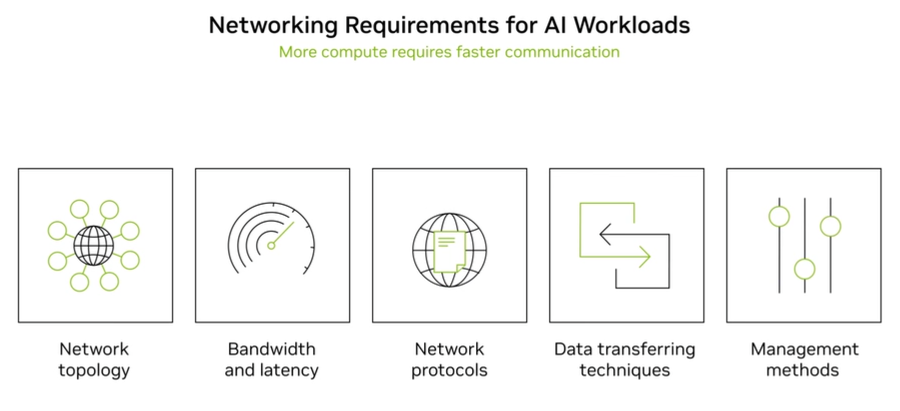
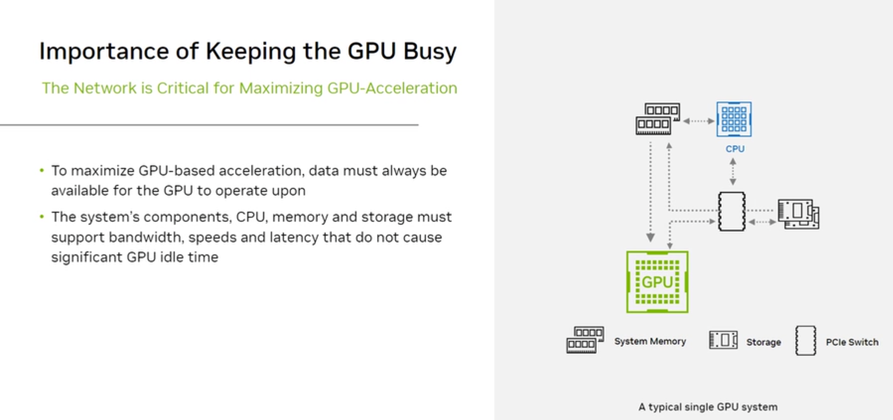
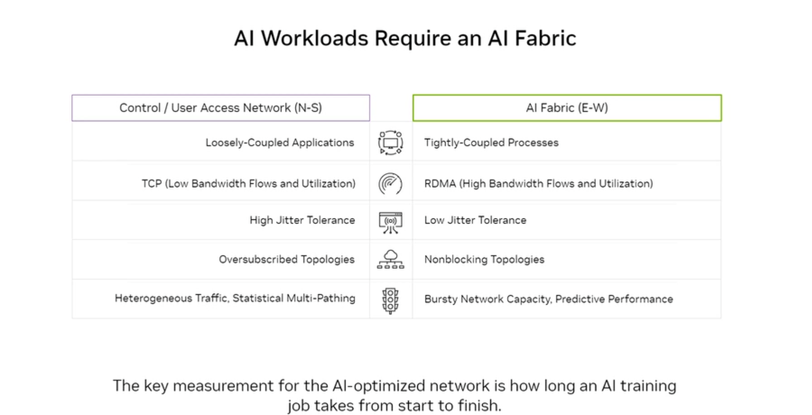
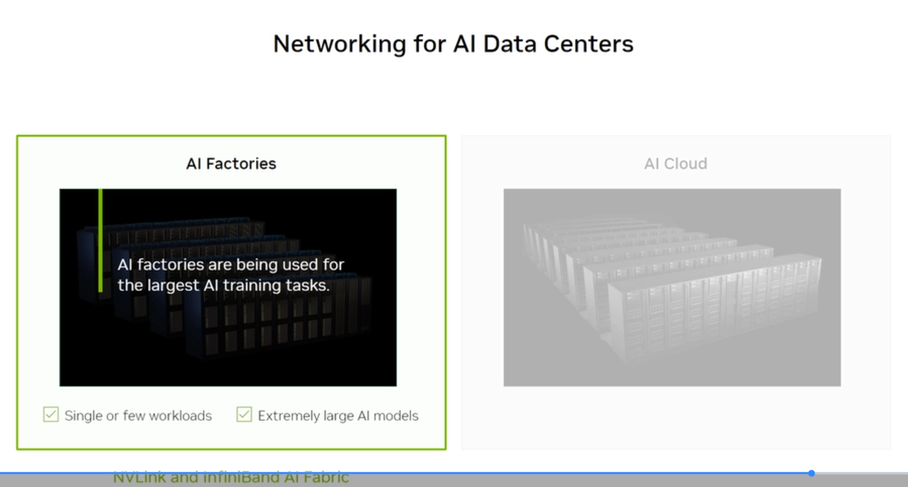
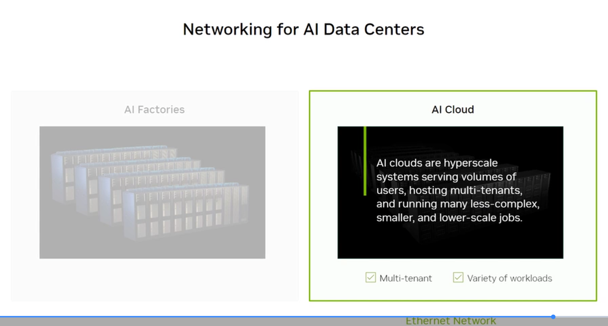

# 2.7 Networking Requirements for AI Workloads

## What the exam tests

Why AI workloads have fundamentally different networking needs than traditional applications, the concept of AI Fabric vs control/user-access network, and the distinction between AI Factories and AI Clouds.

---

## Networking requirements for AI workloads

Five key dimensions of AI network requirements:

| Dimension | Traditional App | AI Workload |
|---|---|---|
| **Network topology** | Tree, star | Fat-tree, non-blocking |
| **Bandwidth** | 1–25 Gbps/server | 400–800 Gbps/GPU |
| **Latency** | Milliseconds acceptable | Microseconds required |
| **Protocols** | TCP/IP (with retransmits) | RDMA (zero-copy, CPU offload) |
| **Management** | SNMP, standard monitoring | AI-aware telemetry |

---

## The network is critical: keep the GPU busy

The core problem: **GPUs can only compute when they have data.** In a distributed training job:

- Every forward pass needs training batch data from storage
- Every backward pass requires gradient exchange with all other GPUs across the network
- If the network stalls waiting for data, the GPU idles — wasted compute at $2–4/hour per GPU

The network's role is to keep the GPU's data supply pipeline full. This means:
- **High bandwidth:** Multi-hundred Gbps per GPU to feed training data and move gradients
- **Low latency:** Gradient all-reduce operations must complete before the next training step can start
- **Low jitter:** Variable latency causes some GPUs to finish early and wait — "GPU bubble" wasted cycles

---

## Two networks in an AI data center

### AI Fabric (East-West) — the scale-up network

| Attribute | AI Fabric (E-W) | Control/User Network (N-S) |
|---|---|---|
| Traffic pattern | Tightly-coupled GPU-to-GPU | Loosely-coupled app traffic |
| Protocol | RDMA (high bandwidth, low CPU overhead) | TCP (standard, higher CPU overhead) |
| Bandwidth | High Bandwidth, high utilization | Low bandwidth flows, statistical multiplexing |
| Latency | Low Jitter Tolerance (microseconds) | High Jitter Tolerance (milliseconds OK) |
| Topology | Nonblocking (fat-tree, dragonfly) | Oversubscribed topologies OK |
| Traffic type | Bursty, predictable, collective operations | Heterogeneous, statistical multiplexing |

**The key measurement** for an AI-optimized network is **how long an AI training job takes from start to finish** — not individual packet latency or throughput, but the end-to-end job completion time.

---

## AI Factories vs AI Cloud

NVIDIA distinguishes two types of AI data center deployments based on workload profile:

### AI Factories
- **Purpose:** Single or few extremely large AI training workloads
- **Models:** Extremely large AI models (trillion-parameter class)
- **Network:** NVLink for scale-up + InfiniBand for scale-out
- **Topology:** Non-blocking fat-tree InfiniBand
- **Example:** NVIDIA DGX SuperPOD, hyperscaler internal training clusters

### AI Cloud
- **Purpose:** Hyperscale multi-tenant services
- **Workloads:** Multiple concurrent, diverse workloads; many smaller jobs
- **Network:** Ethernet (more flexible, lower cost per port at scale)
- **Topology:** ECMP Ethernet with RDMA over Converged Ethernet (RoCE)
- **Example:** AWS, Azure, GCP GPU clouds

**Exam tip:** AI Factory = NVLink + InfiniBand; AI Cloud = Ethernet + RoCE

---

## RDMA: the protocol foundation

RDMA (Remote Direct Memory Access) is the protocol underpinning AI network performance. It allows a GPU/CPU to read or write memory on a remote machine **without involving the remote machine's OS or CPU**.

Benefits:
- **Zero-copy:** Data moves directly GPU↔network without CPU staging buffers
- **CPU offload:** Eliminates OS kernel overhead (kernel bypass)
- **Low latency:** Sub-2 microsecond round-trip
- **High bandwidth:** Saturates 400–800 Gbps links efficiently

RDMA runs over:
- **InfiniBand** (native — RDMA is fundamental to IB)
- **RoCE** (RDMA over Converged Ethernet) — takes RDMA benefits and runs them over standard Ethernet hardware

See [2.8 Networking Protocols](08-networking-protocols/) for full RDMA detail.

---

## Bandwidth requirements per GPU

As GPU performance increases, so does the required network bandwidth:

| GPU Generation | Compute (TFLOPS BF16) | Required network BW |
|---|---|---|
| A100 (2020) | 312 | 200 Gbps |
| H100 (2022) | 989 | 400 Gbps |
| B200 (2024) | ~2,250 | 800 Gbps |

The network must scale proportionally with compute — otherwise the faster GPU simply waits longer for data, with no net training speedup.

---

## Self-check questions

1. What does E-W (East-West) traffic represent in an AI cluster?
2. Why is low jitter more important than average latency for AI training networks?
3. What is the fundamental difference between an AI Factory and an AI Cloud in terms of workloads?
4. What does RDMA stand for and what CPU overhead problem does it solve?
5. Which network (N-S or E-W) uses nonblocking topology and why?

Answers

1. GPU-to-GPU gradient exchange traffic during distributed training — data flowing laterally between servers in the same cluster. This is the dominant traffic type in an AI training fabric. 
2. In a distributed training all-reduce, all GPUs must synchronize. If one GPU experiences high jitter (latency spikes), all other GPUs wait for it — creating a "GPU bubble" of idle compute. Average latency hides worst-case spikes; it's the worst-case (jitter) that kills efficiency. 
3. AI Factory: single or few huge training jobs for the largest models; dedicated, non-blocking InfiniBand fabric. AI Cloud: many concurrent diverse jobs from many tenants; cost-optimized Ethernet with RoCE. 
4. Remote Direct Memory Access. It allows one machine to directly read/write memory on another machine without involving the remote CPU or OS — eliminating kernel copy overhead and dramatically reducing CPU utilization and latency. 
5. E-W (AI Fabric) uses nonblocking topology. In a nonblocking fat-tree, any GPU can communicate with any other GPU at full line rate simultaneously — no oversubscription, no congestion. This is essential for collective operations where all GPUs exchange data at once.

