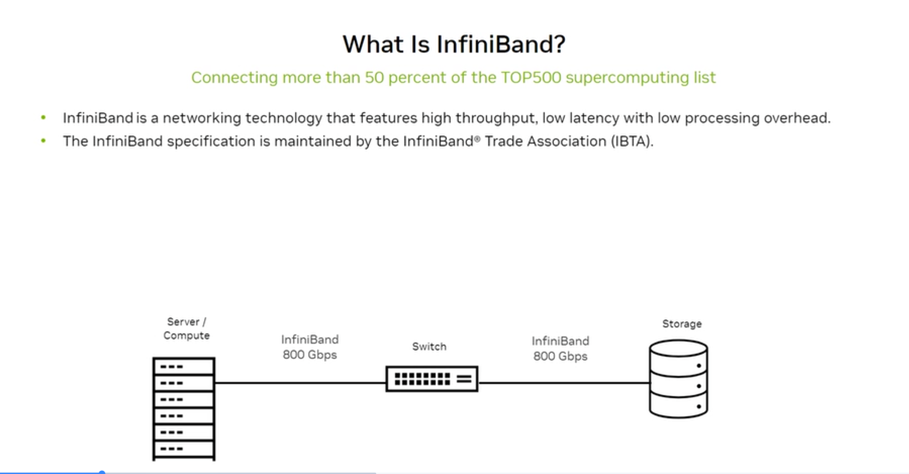
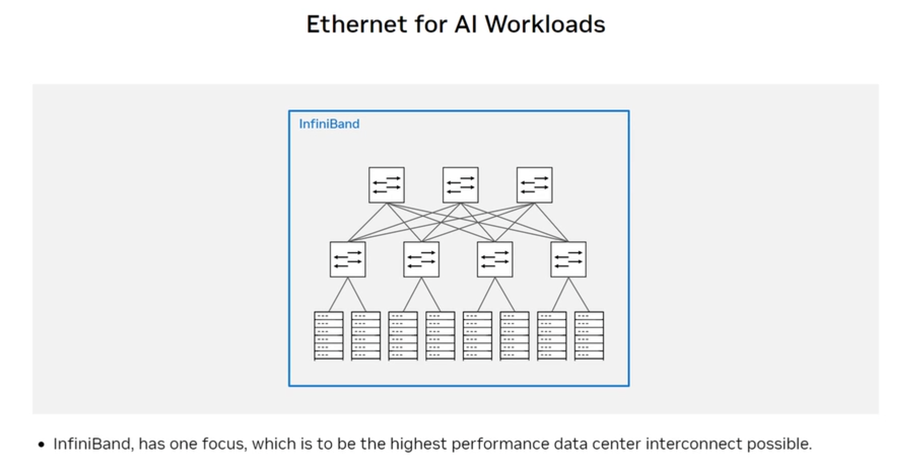
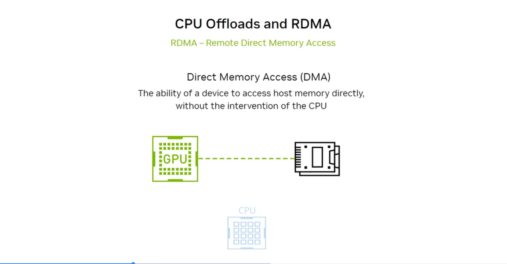
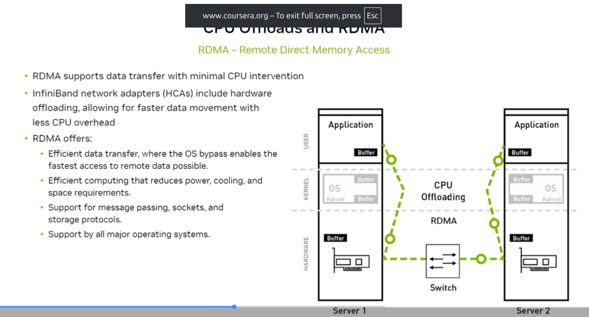
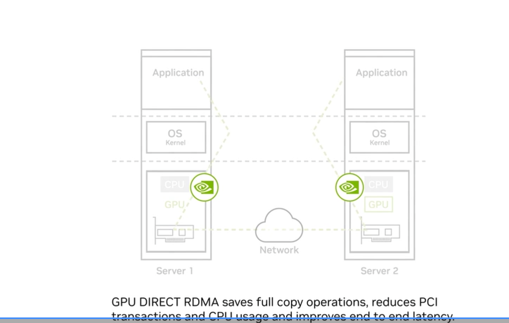

# 2.8 Data Center Networking Protocols and Key Concepts

## What the exam tests

InfiniBand vs Ethernet, RDMA mechanics, GPUDirect RDMA, and why CPU offloads matter for AI networking.

---

## InfiniBand



**InfiniBand (IB)** is a networking technology with a single purpose: be the highest-performance data center interconnect possible.

Key facts:
- High throughput, **low latency** (sub-1 microsecond), low processing overhead
- Native RDMA from day one — not bolted on like RoCE
- Maintained by the **InfiniBand Trade Association (IBTA)**
- Connects >50% of the TOP500 supercomputing list
- Used in AI Factories for the E-W fabric

### InfiniBand speed generations

| Generation | Speed per link | Notes |
|---|---|---|
| SDR | 10 Gbps | Legacy |
| DDR | 20 Gbps | Legacy |
| QDR | 40 Gbps | Legacy |
| FDR | 56 Gbps | Legacy |
| EDR | 100 Gbps | Still deployed |
| HDR | 200 Gbps | Common in H100 clusters |
| NDR | 400 Gbps | Current standard for H100/B200 |
| **XDR (QM9700)** | **800 Gbps** | NVIDIA Quantum-X800; current generation |

### InfiniBand topology


Fat-tree topology: compute nodes at the leaves, spine switches at the top. In a non-blocking fat-tree, aggregate uplink bandwidth equals aggregate downlink bandwidth — no oversubscription. Any node can communicate with any other node at full line rate simultaneously.

---

## RDMA — Remote Direct Memory Access

### Concept: DMA vs RDMA



**DMA (Direct Memory Access):** A device accesses host memory directly without CPU intervention. The GPU already uses DMA to transfer data to/from its own memory.

**RDMA:** Extends DMA across a network. One machine can read or write memory on a **remote** machine's GPU/CPU — the remote machine's CPU and OS are bypassed entirely.

### How RDMA works



Without RDMA (traditional TCP):
```
Application → OS Kernel → TCP stack → NIC → Network → NIC → TCP stack → OS Kernel → Application
(multiple copies; CPU involved every step; high latency; high CPU utilization)
```

With RDMA:
```
Application (user space) → RDMA NIC (HCA) → Network → RDMA NIC → Application
(zero copy; CPU offloaded; sub-microsecond latency)
```

RDMA benefits:
- **Efficient data transfer** — OS bypass enables fastest-possible data movement
- **CPU offloading** — InfiniBand HCAs with hardware acceleration handle RDMA; CPUs free for application work
- **Low power/cooling** — less CPU compute needed for networking = lower power
- **Efficient computing** — reduces power, cooling, and space requirements
- **Supports:** Message passing, sockets, storage protocols (NVMe-oF)

---

## GPUDirect RDMA



Standard RDMA sends GPU data via a detour through CPU memory:
```
GPU Memory → CPU Memory (copy) → NIC → Network
```

**GPUDirect RDMA** enables the NIC to read directly from and write directly to GPU memory — the CPU copy is eliminated:
```
GPU Memory → NIC → Network → NIC → GPU Memory
```

Benefits:
- **Saves full copy operations** — eliminates the GPU→CPU→NIC copy
- **Reduces PCI transactions** — fewer PCIe traversals
- **Reduces CPU usage** — CPU not involved in data movement
- **Improves end-to-end latency** — critical for gradient all-reduce in training

This is the combination that makes large-scale distributed AI training practical: InfiniBand + GPUDirect RDMA + NVLink.

---

## Ethernet for AI Workloads

### Standard Ethernet's limitations for AI


Ethernet is the universal networking standard — but originally designed for TCP traffic with oversubscribed topologies and statistical multiplexing. For AI:
- **TCP has too much overhead** — kernel involvement adds latency and consumes CPU
- **Standard Ethernet is lossy** — packet drops in congestion; TCP retransmits cause latency spikes
- **ECMP load balancing** — standard hash-based ECMP causes flow collisions ("hash polarization")

### RoCE — RDMA over Converged Ethernet

**RoCE (RDMA over Converged Ethernet)** brings RDMA semantics to Ethernet infrastructure:
- Uses standard Ethernet physical layer (ports, cables, transceivers)
- Runs InfiniBand transport layer on top of Ethernet frames
- Requires **lossless Ethernet** (PFC — Priority Flow Control) to avoid packet drops
- Used in AI Cloud deployments where Ethernet is preferred for cost/flexibility

### Two types of RoCE
| | RoCEv1 | RoCEv2 |
|---|---|---|
| Layer | Layer 2 only | Layer 3 (IP-routable) |
| Scope | Same subnet | Routable across subnets |
| Modern use | Legacy | Standard |

---

## Protocol comparison

| | InfiniBand | RoCE | TCP/Ethernet |
|---|---|---|---|
| Latency | < 1 µs | 1–3 µs | 10–100 µs |
| CPU overhead | Minimal (offloaded to HCA) | Minimal | High |
| Loss handling | Lossless by design | Requires PFC (lossless config) | Lossy OK (TCP retransmits) |
| Deployment | AI Factory, HPC | AI Cloud, mixed | Traditional IT |
| NVIDIA product | Quantum-X800 | Spectrum-X | Spectrum |

---

## Self-check questions

1. What does RDMA stand for and what problem does it solve vs standard TCP?
2. What is the difference between DMA and RDMA?
3. Which InfiniBand generation provides 400 Gbps per link?
4. What does GPUDirect RDMA eliminate from the data transfer path?
5. What network configuration does RoCE require to avoid packet drops?

<details>
<summary>Answers</summary>
1. Remote Direct Memory Access. Standard TCP requires the OS kernel to be involved at every network operation, consuming CPU cycles and adding latency. RDMA allows one machine to directly read/write memory on another machine without involving the remote CPU or OS — eliminating kernel overhead and achieving sub-microsecond latency.<br>
2. DMA: a device accesses the local machine's memory without CPU involvement. RDMA: a device on the network accesses memory on a remote machine without involving the remote CPU or OS — it extends DMA semantics across a network link.<br>
3. NDR (Next Data Rate) InfiniBand — 400 Gbps per port. XDR (Quantum-X800) provides 800 Gbps per port.<br>
4. GPUDirect RDMA eliminates the CPU memory copy in the data path: GPU Memory → NIC → Network (removing the GPU→CPU→NIC bounce). This saves copy operations, reduces PCI transactions, and removes CPU involvement from the data transfer path.<br>
5. Lossless Ethernet — specifically PFC (Priority Flow Control), which creates per-priority pause frames to prevent packet drops during congestion. Without lossless Ethernet, RoCE packets are dropped and RDMA performance collapses.
</details>
