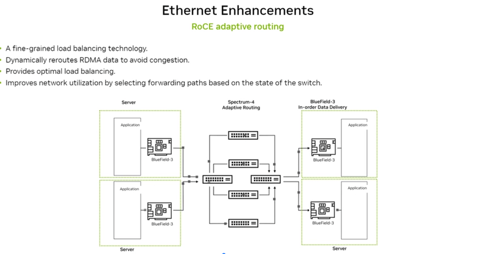
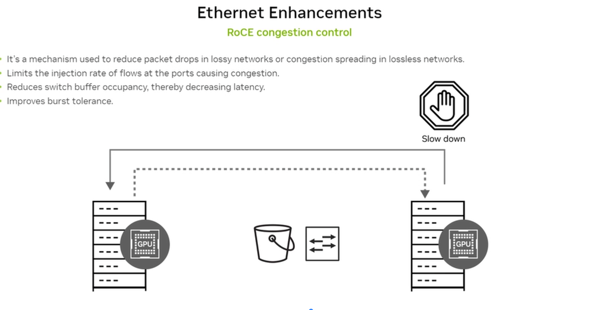
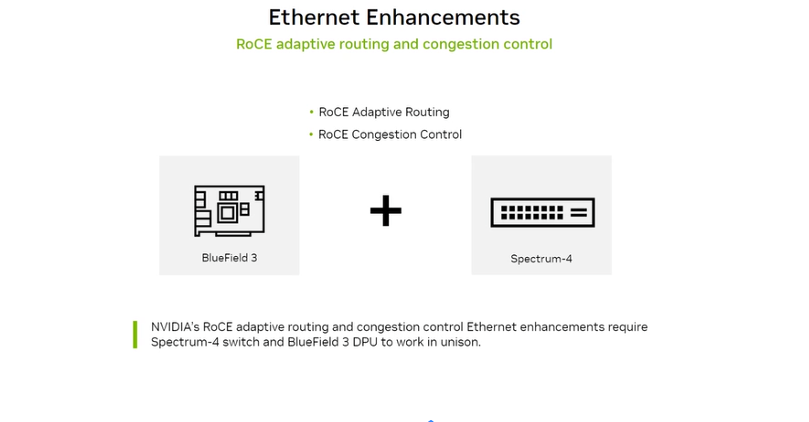

# 2.9 High-Speed Data Center Network Options and Use Cases

## What the exam tests

The NVIDIA networking product portfolio — Quantum-X800 InfiniBand, Spectrum-X Ethernet, Photonics switches — their specs, and when to choose each.

---

## NVIDIA Networking Portfolio Overview

NVIDIA's networking portfolio covers all network segments in an AI cluster:

| Segment | Technology | NVIDIA Products |
|---|---|---|
| **Scale-up (within node)** | NVLink + NVSwitch | NVLink Switch, NVSwitch |
| **Scale-out E-W (between nodes)** | InfiniBand | Quantum-X800, ConnectX-8 SuperNIC |
| **Scale-out E-W (Ethernet option)** | Ethernet + RoCE | Spectrum-X, BlueField-3 DPU |
| **N-S / User Access / Storage Management** | Ethernet | Spectrum, BlueField-3 |

---

## Option 1: NVIDIA Quantum-X800 InfiniBand

**Quantum-X800 (QM9700)** is NVIDIA's latest InfiniBand switch platform for AI Factories.

### Quantum-X800 Q3400-RA Switch
- **144 ports** of 800 Gb/s connectivity per port
- **4th generation NVIDIA SHARP** (Scalable Hierarchical Aggregation and Reduction Protocol) — performs collective operations (all-reduce) *in the network*, reducing GPU-to-host communication
- Adaptive routing, congestion control
- Advanced power management
- Total switch bandwidth: **144 × 800 Gbps = 115.2 Tbps**

### ConnectX-8 SuperNIC (endpoint adapter)
- **800 Gb/s** end-to-end connectivity per NIC
- Supports both InfiniBand and Ethernet
- PCIe Gen6 (up to 48 lanes) — highest CPU↔NIC bandwidth available
- In-network compute offloads

### When to use Quantum-X800 (InfiniBand)
- AI Factories running the largest training jobs
- Where lowest latency and highest bandwidth per GPU is required
- Non-blocking fat-tree topology needed
- SHARP in-network compute reduces gradient all-reduce time

---

## Option 2: NVIDIA Spectrum-X Ethernet

**Spectrum-X** is the world's first Ethernet platform purpose-built for AI. It combines standard Ethernet connectivity with RDMA-class performance.

### Components

| Component | Description |
|---|---|
| **Spectrum-X Ethernet Switch** | Specialized Ethernet switch with AI-optimized routing and congestion control |
| **Spectrum-X Ethernet SuperNICs** | ConnectX-7/8 SmartNICs with RDMA and AI offloads |

### Spectrum-X Software Stack
- Cumulus, NetQ, NVIDIA Air, RCP, CloudAI
- SAI/SPSDK, DOCA

### Key capabilities
- **Nearly perfect effective bandwidth at scale** — specifically engineered to maintain near-line-rate throughput even with many concurrent flows, eliminating the bandwidth degradation seen in standard Ethernet under AI workloads
- **Extremely low latency** — competitive with InfiniBand for intra-cluster AI traffic
- **NCCL-optimized RoCE extensions** — Adaptive Routing, Congestion Control (see below)
- **Tight integration** with NVIDIA BlueField-3 DPUs for in-network processing
- **Validated** across NVIDIA software stack (CUDA, NCCL, AI Enterprise, DOCA)

### When to use Spectrum-X (Ethernet)
- AI Cloud deployments (multi-tenant, diverse workloads)
- Environments standardizing on Ethernet for operational simplicity
- When InfiniBand switch cost/management overhead is prohibitive
- RoCE workloads needing enterprise-class AI networking

---

## Ethernet Enhancements for AI

### RoCE Adaptive Routing

**Problem:** Standard ECMP (Equal-Cost Multi-Path) routing assigns flows to paths using a hash. Heavy flows can collide on the same path while other paths sit idle — causing congestion on one path and wasted bandwidth on others.

**RoCE Adaptive Routing:**
- Fine-grained load balancing at the packet (or flowlet) level
- Dynamically reroutes RDMA data across available paths based on current congestion state
- Uses the **Spectrum-4 switch** to monitor per-port utilization and make real-time routing decisions
- Provides **optimal load balancing** across all available paths
- **Improves network utilization** and reduces congestion

### RoCE Congestion Control

**Problem:** In lossless Ethernet (required for RoCE), congestion spreads via PFC pause frames — one congested port pauses traffic upstream, causing head-of-line blocking that propagates across the fabric.

**RoCE Congestion Control:**
- Limits the injection rate of flows *causing* congestion at the source
- Reduces switch buffer occupancy → decreases latency
- Improves burst tolerance
- Mechanism: ECN (Explicit Congestion Notification) marks congested packets; receiver signals sender to slow down (DCQCN algorithm)

### Combined requirement

NVIDIA's full RoCE enhancement stack requires both components working together:
- **BlueField-3 DPU** (at each server) — handles in-order delivery and congestion signals
- **Spectrum-4 switch** — performs adaptive routing and sends congestion notifications

> "NVIDIA's RoCE adaptive routing and congestion control Ethernet enhancements require Spectrum-4 switch and BlueField-3 DPU to work in unison."

---

## Option 3: NVIDIA Photonics Switches

For the most demanding scale-out AI clusters, NVIDIA offers co-packaged optics (CPO) switching platforms.

### Products

| Product | Bandwidth | Ports | Cooling |
|---|---|---|---|
| **Quantum-X Photonics** (Quantum 3450-LD) | **115 Tb/s** | 144 ports of 800G (576 × 200G) | Liquid cooled |
| **Spectrum-X Photonics** (Spectrum SN6810) | **102.4 Tb/s** | 128 ports of 800G (512 × 200G) | Liquid cooled |
| **Spectrum-X Photonics** (Spectrum SN6800) | **409.6 Tb/s** | 512 ports of 800G (2048 × 200G) | vLiquid cooled |

### What is co-packaged optics?
Traditional switches use pluggable transceivers (QSFP, OSFP) — the optical module is external. In CPO switches, the optical components are integrated directly into the switch ASIC package. This eliminates the electrical signal path between ASIC and transceiver, dramatically reducing power and enabling higher port counts.

### Use case
Scale AI Factories to **millions of GPUs** — the photonics platforms are designed for the hyperscale AI factory buildouts that require ultra-high density and the lowest power per bit of bandwidth.

---

## Choosing the right networking option

| Scenario | Recommended | Why |
|---|---|---|
| Largest LLM training, maximum throughput | **Quantum-X800 IB** | Lowest latency, SHARP in-network compute, non-blocking |
| Multi-tenant AI cloud, Ethernet preference | **Spectrum-X** | Ethernet operations, RoCE adaptive routing/CC |
| Hyperscale AI factory (millions of GPUs) | **Photonics switches** | Ultra-high density, CPO power efficiency |
| Both IB and Ethernet needed | ConnectX-8 SuperNIC | Supports both protocols in one adapter |

---

## Self-check questions

1. How many ports does the Quantum-X800 (Q3400-RA) switch have, and at what speed?
2. What does SHARP stand for and what does it do in the network?
3. What two NVIDIA hardware components are required for RoCE adaptive routing and congestion control to work?
4. What is co-packaged optics (CPO) and why does it enable higher port counts?
5. When would you choose Spectrum-X over Quantum-X800?

Answers

1. 144 ports at 800 Gb/s per port. 
2. Scalable Hierarchical Aggregation and Reduction Protocol. SHARP performs collective operations (like all-reduce for gradient synchronization) directly inside the network switches — reducing the volume of data that GPUs need to send to and receive from each other. 
3. BlueField-3 DPU (at each server) + Spectrum-4 switch. Both must be present and working together. 
4. Co-packaged optics integrates optical components directly into the switch ASIC package, eliminating the electrical path between ASIC and external transceiver. This reduces power consumption and removes the bandwidth bottleneck of the electrical interface, enabling higher aggregate bandwidth per switch. 
5. When: standardizing on Ethernet for multi-tenant environments; when operational simplicity of one network type (Ethernet) is preferred; for AI Cloud deployments; when InfiniBand management expertise is not available. Spectrum-X delivers near-InfiniBand performance for RoCE workloads using familiar Ethernet tooling.

