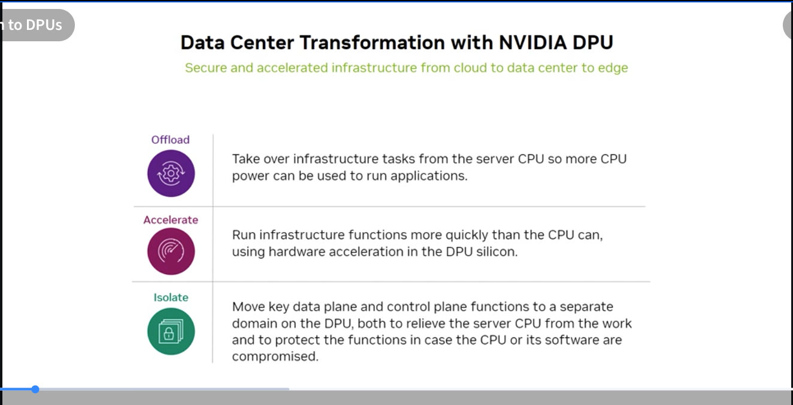
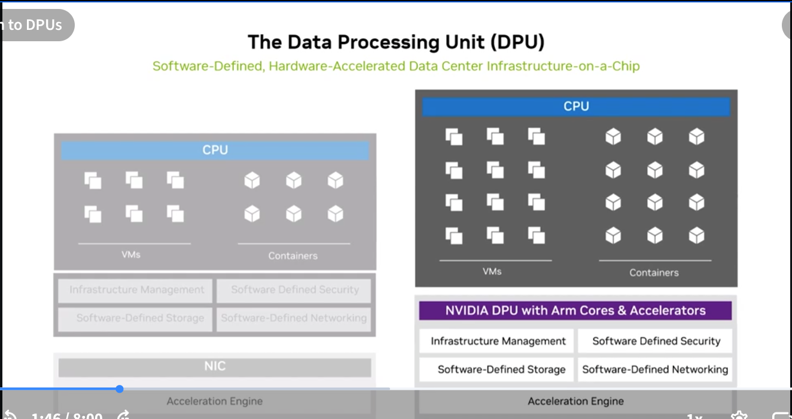
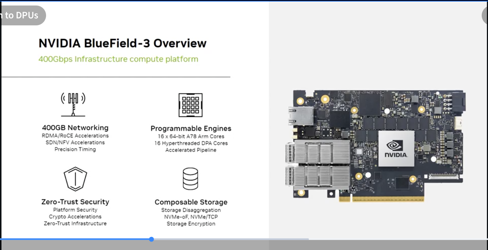
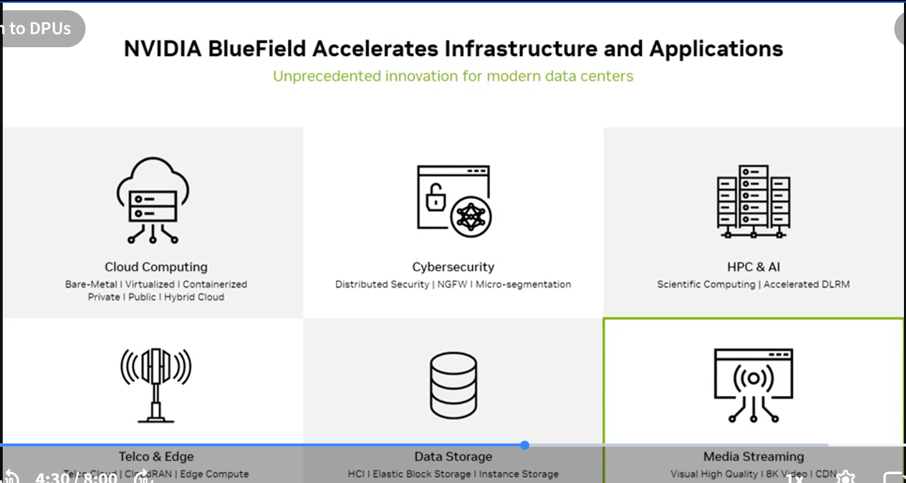
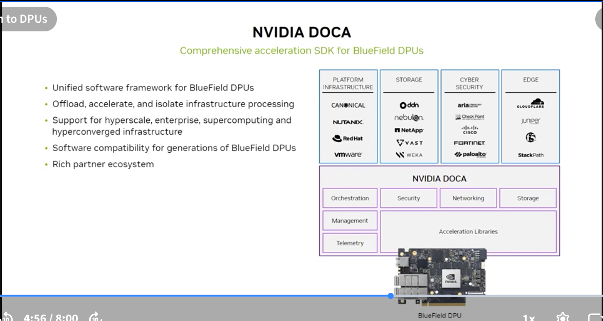
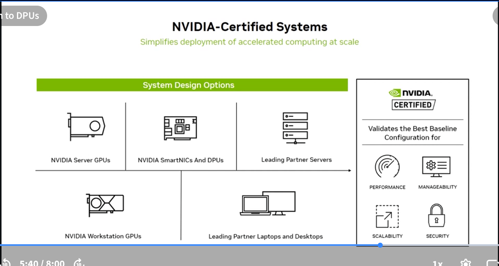
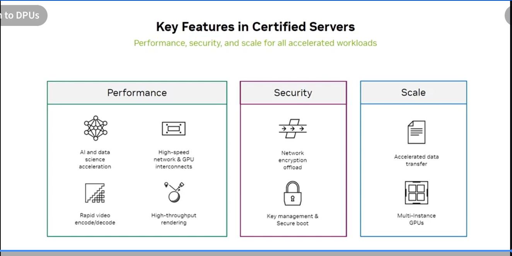

# 2.10 DPU — Data Processing Unit Purpose and Benefits

## What the exam tests

What a DPU is, its three core functions (offload, accelerate, isolate), the BlueField-3 specs, DOCA SDK, and NVIDIA-Certified Systems.

---

## Data Center Transformation with NVIDIA DPU



The DPU enables **secure and accelerated infrastructure** from cloud to data center to edge through three fundamental functions:

### 1. Offload
> *Take over infrastructure tasks from the server CPU so more CPU power can be used to run applications.*

Infrastructure software (networking, storage, security) traditionally runs on the server CPU, consuming cores that could be running the actual workload (ML training, inference, database queries). The DPU offloads these functions to dedicated Arm cores + accelerators on the DPU silicon.

### 2. Accelerate
> *Run infrastructure functions more quickly than the CPU can, using hardware acceleration in the DPU silicon.*

DPU silicon includes dedicated accelerators for:
- Packet processing (100–400 Gbps wire-speed)
- Cryptography (TLS/IPsec offload)
- Storage (NVMe-oF, compression, deduplication)
- Regular expressions (security pattern matching)

A CPU handles ~10–40 Gbps of encrypted traffic. A BlueField-3 DPU handles **400 Gbps** with hardware crypto acceleration.

### 3. Isolate
> *Move key data plane and control plane functions to a separate domain on the DPU, both to relieve the server CPU from the work and to protect the functions in case the CPU or its software are compromised.*

Security isolation: if the server OS is compromised (ransomware, privilege escalation), the DPU continues to enforce network policies, encryption, and access controls — because the DPU runs a separate, isolated OS that the compromised host cannot reach.

---

## DPU Architecture: Software-Defined Data Center Infrastructure on a Chip



### Traditional server (without DPU)
```
CPU handles:
  ├── Application workload
  ├── VMs / Containers
  ├── Infrastructure Management
  ├── Software-Defined Security
  ├── Software-Defined Storage
  ├── Software-Defined Networking
  └── NIC (basic forwarding only)
```

### Server with NVIDIA DPU
```
CPU handles:              DPU handles:
  ├── Application           ├── Infrastructure Management
  ├── VMs/Containers        ├── Software-Defined Security
                            ├── Software-Defined Storage
                            ├── Software-Defined Networking
                            └── Acceleration Engine
```

**Result:** The CPU is freed from infrastructure overhead — all its cores are available for the actual workload. GPU servers especially benefit because the CPUs can focus on data preprocessing, checkpointing, and orchestration rather than network/storage stack.

---

## NVIDIA BlueField-3 DPU



BlueField-3 is NVIDIA's current-generation DPU, described as "400Gbps infrastructure compute platform."

### Key specifications

| Feature | Specification |
|---|---|
| **Network** | **400GbE** networking |
| **Programmable Engines** | 16× Arm A78 cores, 64-bit cores for infrastructure services |
| **Accelerated Pipelines** | Crypto, regex, compression, storage |
| **Zero-Trust Security** | Platform security, secure boot |
| **Composable Storage** | NVMe-oF, storage disaggregation via PCIe and TCP |

### BlueField-3 use cases



| Domain | Use Case |
|---|---|
| **Cloud Computing** | Bare-metal provisioning, VM/container isolation, private/public/hybrid cloud |
| **Cybersecurity** | Distributed security, NGFW, micro-segmentation — enforced at the NIC, independent of host |
| **HPC & AI** | Scientific computing, accelerated DLRM |
| **Telco & Edge** | O-RAN, 5G edge compute |
| **Data Storage** | HCI, Elastic Block Storage, Instance Storage (NVMe-oF offload) |
| **Media Streaming** | Visual High Quality, 8K video, CDN |

---

## NVIDIA DOCA — The BlueField SDK



**DOCA** (Data Center Infrastructure on a Chip Architecture) is the comprehensive software framework for programming BlueField DPUs.

### What DOCA provides
- **Unified software framework** across all BlueField DPU generations
- Libraries for: Orchestration, Security, Networking, Storage, Management, Telemetry
- **Acceleration Libraries** that expose DPU hardware accelerators
- Software compatibility across generations — code written for BlueField-2 runs on BlueField-3

### DOCA partner ecosystem
DOCA integrates with the major platform players:

| Category | Partners |
|---|---|
| Platform Infrastructure | Canonical, Nutanix, Red Hat, VMware |
| Storage | DDN, NetApp, VAST, WEKA |
| Cyber Security | Check Point, Cisco, Fortinet, Palo Alto, Aria (Arista) |
| Edge | CloudFlare, Juniper, StackPath |

---

## NVIDIA-Certified Systems




**NVIDIA-Certified Systems** validate the best baseline configuration for deploying NVIDIA GPU and DPU hardware at scale.

### System design options
- NVIDIA Server GPUs
- NVIDIA SmartNICs and DPUs (BlueField)
- Leading partner servers (Dell, HPE, Lenovo, Supermicro, etc.)
- NVIDIA Workstation GPUs
- Leading partner laptops and desktops

### What certification validates

| Pillar | Features |
|---|---|
| **Performance** | AI and data science acceleration, high-speed network & GPU interconnects, rapid video encode/decode, high-throughput rendering |
| **Security** | Network encryption offload, key management & secure boot |
| **Scale** | Accelerated data transfer, Multi-Instance GPU (MIG) support |

### Why it matters
NVIDIA-Certified Systems *"simplify deployment of accelerated computing at scale"* — enterprises get a validated, pre-tested configuration rather than discovering incompatibilities after purchase.

---

## DPU vs CPU vs GPU: what each handles

```
┌─────────────────────────────────────────────────────────────┐
│  GPU — AI/ML compute, rendering, HPC                        │
│  CPU — Application logic, orchestration, preprocessing      │
│  DPU — Network, storage, security (offloaded from CPU)      │
└─────────────────────────────────────────────────────────────┘

Together: The three-chip architecture that powers modern AI servers
```

The DPU is sometimes called the **third pillar** of computing alongside CPU and GPU — each specialized for a different class of workload.

---

## Self-check questions

1. What are the three core functions of a DPU?
2. How does the DPU's isolation function improve security?
3. What is DOCA and what problem does it solve for DPU developers?
4. Which BlueField generation provides 400GbE connectivity?
5. What is an NVIDIA-Certified System and why does it matter?

<details>
<summary>Answers</summary>
1. Offload (infrastructure tasks from CPU), Accelerate (run infrastructure functions faster than CPU using hardware silicon), Isolate (move data/control plane to separate DPU domain for security).<br>
2. The DPU runs its own OS on Arm cores that are physically and logically separate from the host server's CPU and OS. If the host OS is compromised, the attacker cannot reach the DPU's security enforcement — network policies, encryption, and firewall rules continue to operate independently.<br>
3. DOCA is the comprehensive software SDK for programming all BlueField DPU generations. It provides a unified API across hardware generations, so infrastructure software written for one BlueField generation is compatible with future generations without rewriting.<br>
4. BlueField-3 — 400GbE networking.<br>
5. An NVIDIA-Certified System is a server (from Dell, HPE, Lenovo, etc.) that has been validated by NVIDIA for the best baseline GPU/DPU configuration. Certification tests performance, security, and scalability — giving enterprises a guaranteed-compatible platform rather than dealing with integration issues from untested combinations.
</details>
