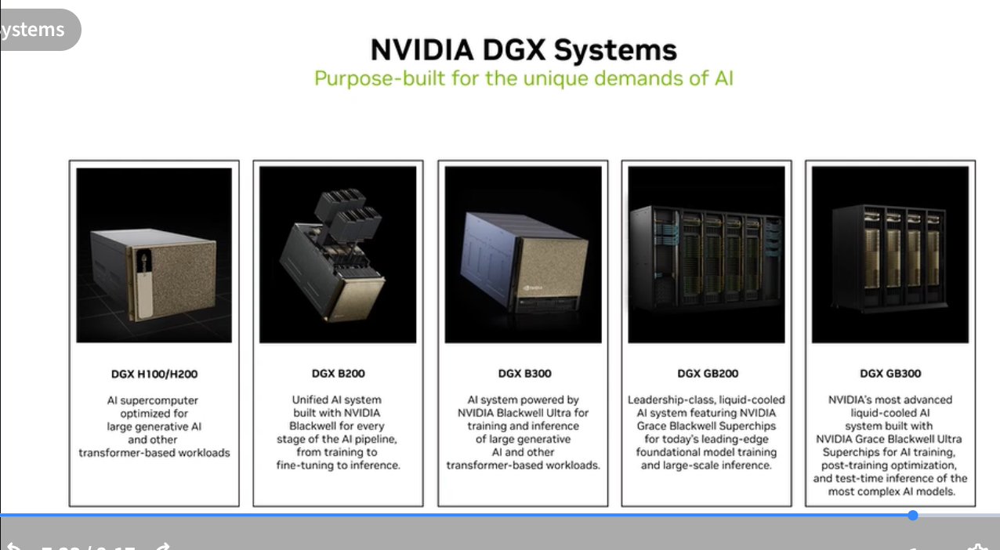
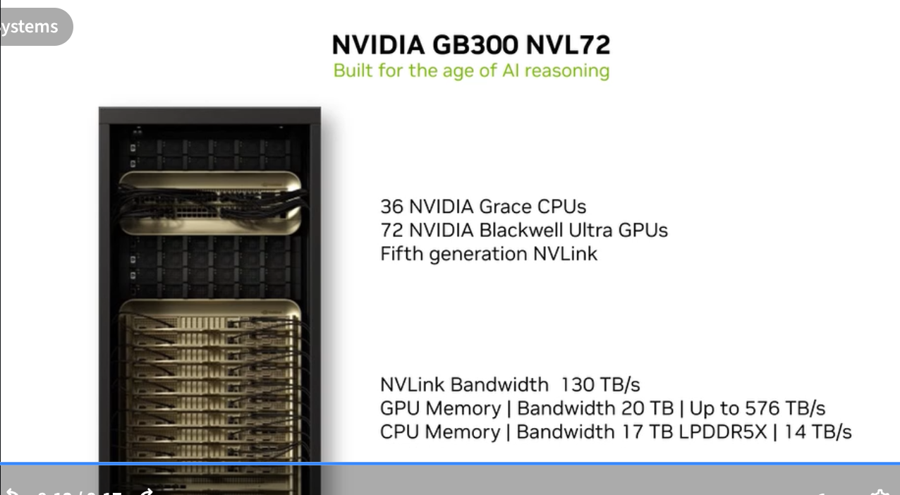
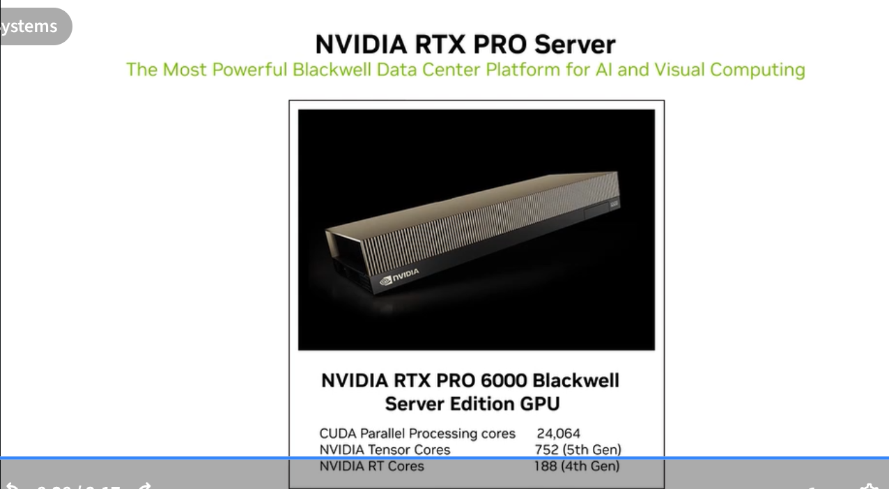

# NVIDIA DGX Systems

Purpose-built AI training systems — "the gold standard for AI infrastructure."

---

## DGX Systems Lineup

| System | GPUs | Key positioning |
|---|---|---|
| DGX H100/H200 | 8× H100/H200 SXM | Optimized for AI and all transformer-based workloads |
| DGX B200 | 8× B200 SXM | Built with NVIDIA Blackwell; from training to inference and all other transformer-based workloads |
| DGX B300 | 8× B300 SXM | Latest Blackwell Ultra; highest AI throughput per node |
| DGX GB200 | Multiple GB200 | Leadership-class training; foundational model training |
| DGX GB300 NVL72 | 72× B300 + 36× Grace | NVIDIA's most advanced Superchip AI server rack |

---

## DGX H100 — The Gold Standard

> "The world's first AI system with the power of a data center."

| Component | Specification |
|---|---|
| GPUs | 8× NVIDIA H100 SXM5 80GB Tensor Core GPUs |
| GPU Interconnect | 4× NVSwitch (all-to-all 900 GB/s per GPU) |
| System Memory | 2 TB |
| Storage | 30 TB NVMe SSDs |
| Network | 8× ConnectX-7 400 Gbps InfiniBand NICs |
| CPUs | 2× Intel Xeon Platinum 8480C |
| AI Performance | 32 quadrillion operations per second |

### DGX H100 Physical Design

- **Form factor:** 10U rack unit
- Components: Front panel (power, I/O), fan modules, NVLink switches, 8× H100 GPUs, NVMe drives, power supplies, 4× ConnectX-7 network modules, motherboard tray

---

## GB300 NVL72 — Rack-Scale AI

> "Built for the age of AI reasoning."

The GB300 NVL72 is not a single server — it's an entire rack as one computing unit:

| Component | Specification |
|---|---|
| GPUs | 72× NVIDIA Blackwell Ultra (B300) |
| CPUs | 36× NVIDIA Grace CPUs |
| NVLink generation | 5th generation |
| NVLink Bandwidth | **130 TB/s** total |
| GPU Memory | **20 TB** total @ 576 TB/s bandwidth |
| CPU Memory | **14 TB** LPDDR5X |

**Key concept:** All 72 GPUs are connected via 5th-gen NVLink — they form a single, unified compute fabric at rack scale. There is no InfiniBand "hop" between nodes within the rack; NVLink connects everything.

---

## RTX PRO Server

> "The Most Powerful Blackwell Data Center Platform for AI and Visual Computing"

NVIDIA RTX PRO 6000 Blackwell Server Edition GPU:

| Spec | Value |
|---|---|
| CUDA parallel processing cores | 24,064 |
| Tensor Cores | 752 (5th generation) |
| RT Cores | 188 (4th generation) |
| Architecture | Blackwell |
| Target | AI workloads + professional visualization in data center |

The RTX PRO Server is the platform for organizations that need both high-performance AI inference **and** photorealistic rendering, simulation, or digital twin workloads on the same server infrastructure.

---

## DGX vs NVIDIA-Certified Servers

| | DGX Systems | NVIDIA-Certified Servers |
|---|---|---|
| Built by | NVIDIA | Third-party OEMs (Dell, HPE, Lenovo, etc.) |
| Configuration | Fixed, NVIDIA-engineered | Variable, NVIDIA-validated |
| Support | NVIDIA Support (optional) | OEM support |
| Use case | Maximum performance; NVIDIA reference design | Flexible deployments, existing vendor relationships |
| GPU options | NVIDIA SXM (highest perf) | PCIe or SXM depending on OEM |
