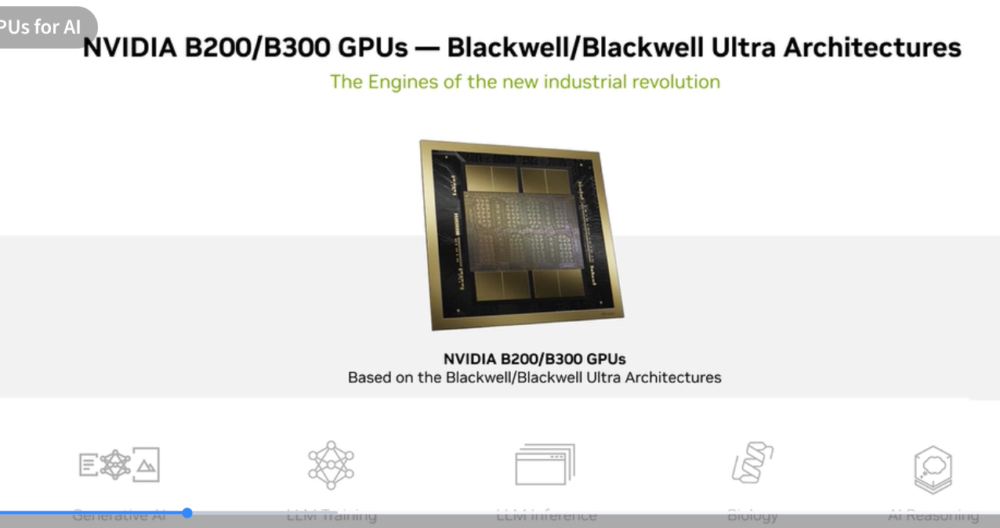
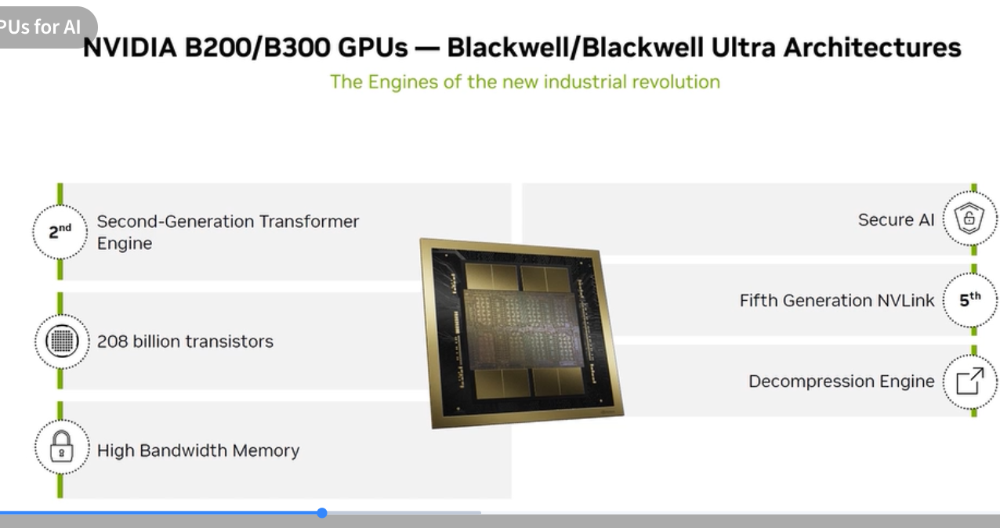
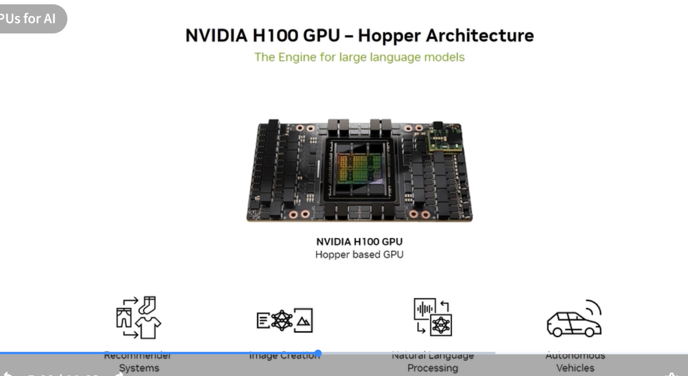
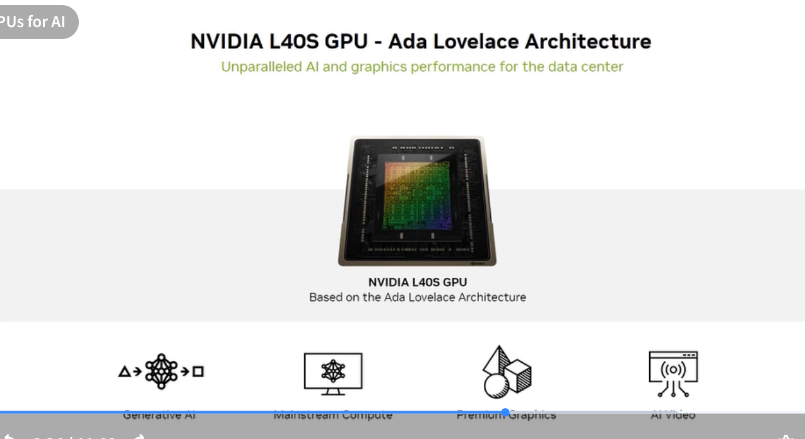
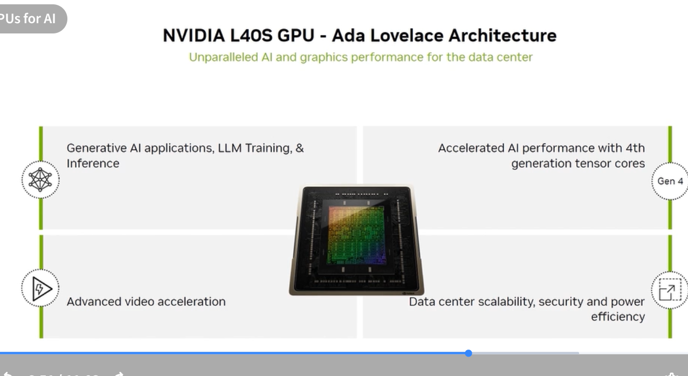
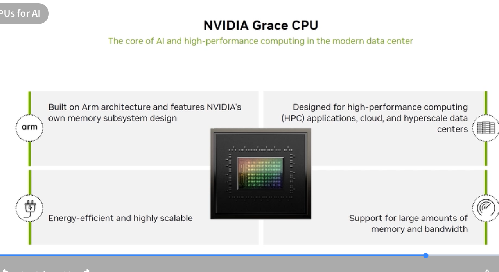

# NVIDIA GPU Families

Cross-reference for all data center GPU products. See [Domain 1.6](../01-essential-ai-knowledge/06-nvidia-solutions/) for workload mapping.

---

## Architecture Overview

---

## Blackwell / Blackwell Ultra — B200, B300

### B200 / B300 Introduction

### B200 / B300 Specifications

| Spec | Value |
|---|---|
| Architecture | Blackwell / Blackwell Ultra |
| Transistors | 208 billion |
| Transformer Engine | 2nd generation (FP4/FP8/BF16/FP16) |
| NVLink | 5th generation (1.8 TB/s bidirectional) |
| Memory | HBM3e |
| B200 TDP | ~1,000 W (SXM form factor) |
| Key features | 2nd-gen Transformer Engine, Secure AI, Decompression Engine |

**Primary workloads:** Generative AI (LLM training + inference), AI reasoning, biology/drug discovery

---

## Hopper — H100, H200

| | H100 SXM5 | H100 PCIe | H200 SXM5 |
|---|---|---|---|
| Memory | 80 GB HBM3 | 80 GB HBM2e | 141 GB HBM3e |
| Memory BW | 3.35 TB/s | 2.0 TB/s | 4.8 TB/s |
| Peak TF (BF16) | 989 TFLOPS | 756 TFLOPS | 989 TFLOPS |
| NVLink | 4th gen, 900 GB/s | 4th gen | 4th gen |
| TDP | 700 W | 350 W | 700 W |

**Primary workloads:** LLMs, data analytics, conversational AI, NLP, autonomous vehicles

---

## Ada Lovelace — L40S, L40, L4

### L40S (Data Center)

| Spec | L40S | L40 | L4 |
|---|---|---|---|
| Memory | 48 GB GDDR6 | 48 GB GDDR6 | 24 GB GDDR6 |
| Memory BW | 864 GB/s | 864 GB/s | 300 GB/s |
| Tensor Core gen | 4th | 4th | 4th |
| RT Core gen | 3rd | 3rd | 3rd |
| TDP | 350 W | 300 W | 72 W |
| Video codec | AV1 enc/dec | H.264/H.265 | AV1 enc/dec |

**L40S use cases:** Generative AI inference + graphics, mainstream data center compute, AI video  
**L4 use cases:** VDI, edge inference, AI video at low power

---

## Grace CPU

| Spec | Value |
|---|---|
| ISA | Arm Neoverse V2 (72 cores) |
| Memory | LPDDR5X (proprietary subsystem design) |
| Interface | NVLink-C2C (to GPU in Superchip configs) |
| TDP | ~500 W (in GB200 Superchip config) |

**Primary use:** HPC, hyperscale cloud, building block for Grace Superchips

---

## RTX PRO Server

| Spec | RTX PRO 6000 Blackwell Server |
|---|---|
| CUDA cores | 24,064 |
| Tensor Cores | 752 (5th gen) |
| RT Cores | 188 (4th gen) |
| Architecture | Blackwell |
| Purpose | AI + professional visualization in data center |
