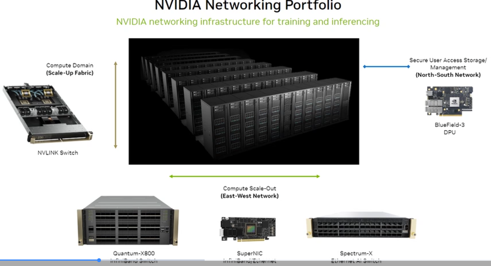
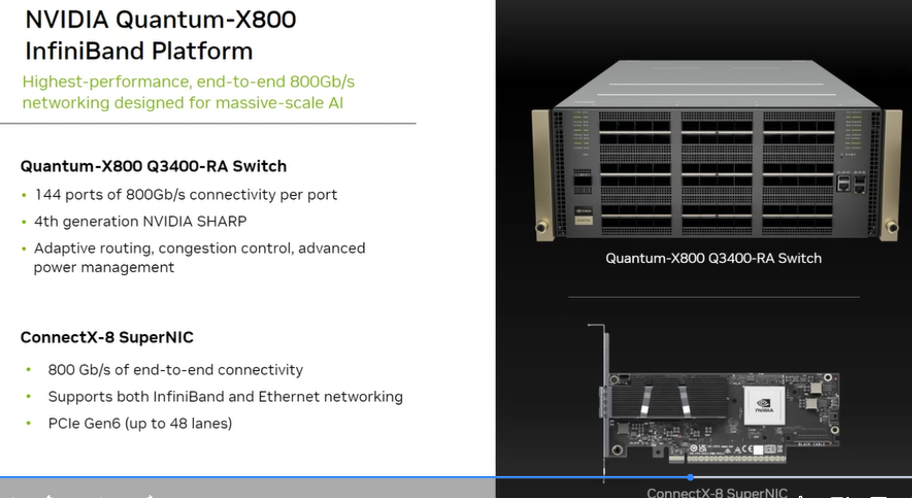
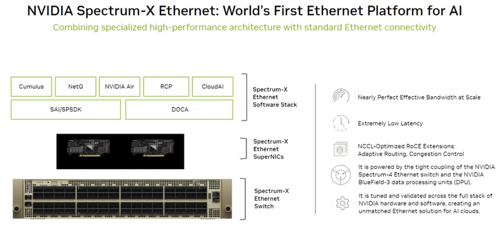
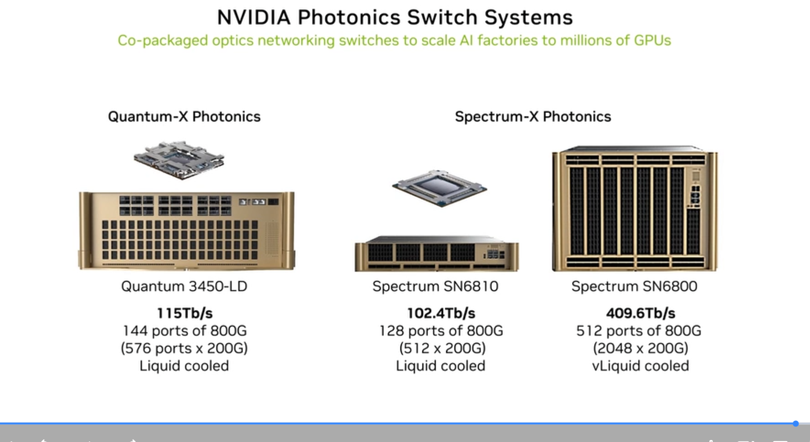

# NVIDIA Networking Hardware

See [Domain 2.8](../02-ai-infrastructure/08-networking-protocols/) and [Domain 2.9](../02-ai-infrastructure/09-high-speed-network-options/) for full protocol and use-case context.

---

## Portfolio Overview

| Product family | Technology | Role in cluster |
|---|---|---|
| ConnectX / SuperNIC | InfiniBand + Ethernet | Server-side NIC (endpoint adapter) |
| BlueField-3 | DPU (SmartNIC) | Infrastructure offload, security, storage |
| Quantum-X800 | InfiniBand switch | E-W AI fabric (scale-out) |
| Spectrum-X | Ethernet switch | E-W AI fabric (Ethernet option) |
| Spectrum | Standard Ethernet | N-S management/user network |
| Photonics switches | CPO IB/Eth | Ultra-high density scale-out |

---

## ConnectX — Server Adapters (SuperNICs)

| Product | Bandwidth | Key features |
|---|---|---|
| ConnectX-7 | 400 Gbps | InfiniBand + Ethernet dual-mode; PCIe Gen5 |
| ConnectX-8 | **800 Gbps** | PCIe Gen6, 48 lanes; InfiniBand + Ethernet; AI compute offloads |

ConnectX-8 is the standard NIC for Blackwell-era servers — 800 Gbps matches B200 GPU network requirements.

---

## BlueField-3 DPU

| Spec | BlueField-3 |
|---|---|
| Network | 400 GbE |
| Arm cores | 16× Arm A78 cores |
| Accelerators | Crypto, regex, compression, NVMe-oF |
| SDK | DOCA |
| Security | Zero-Trust, secure boot |
| Storage | Composable NVMe-oF |

BlueField-3 is both a high-performance NIC (400 GbE) and a programmable DPU running infrastructure workloads. When RoCE adaptive routing + congestion control is needed, BlueField-3 must be paired with Spectrum-4 switch.

---

## Quantum-X800 InfiniBand

### Quantum-X800 Q3400-RA Switch
| Spec | Value |
|---|---|
| Ports | 144 × 800 Gbps |
| Total bandwidth | 115.2 Tbps |
| SHARP generation | 4th gen |
| Features | Adaptive routing, congestion control, power management |

### Use case
AI Factories — maximum performance, lowest latency, SHARP in-network compute

---

## Spectrum-X Ethernet

| Feature | Description |
|---|---|
| Protocol | Ethernet (standard physical layer) |
| RDMA | RoCEv2 with NVIDIA enhancements |
| Routing | Adaptive routing (requires Spectrum-4 + BlueField-3) |
| Congestion control | DCQCN via BlueField-3 DPU |
| Software | Cumulus, NetQ, Air, RCP, DOCA |

**Key claim:** "World's First Ethernet Platform for AI" — delivers near-InfiniBand RDMA performance on standard Ethernet infrastructure.

---

## Photonics Switches

Co-packaged optics (CPO) for ultra-scale AI Factories:

| Product | BW | Ports | Cooling |
|---|---|---|---|
| Quantum-X Photonics (3450-LD) | 115 Tb/s | 144 × 800G (576 × 200G) | Liquid |
| Spectrum SN6810 | 102.4 Tb/s | 128 × 800G (512 × 200G) | Liquid |
| Spectrum SN6800 | **409.6 Tb/s** | 512 × 800G (2048 × 200G) | vLiquid |

---

## Quick selection guide

| Scenario | Choose |
|---|---|
| AI Factory, maximum throughput | Quantum-X800 IB + ConnectX-8 |
| AI Cloud, Ethernet standardized | Spectrum-X + BlueField-3 |
| Infrastructure security offload | BlueField-3 DPU |
| Hyperscale millions of GPUs | Photonics switches |
| Management/user-access network | Spectrum (standard Ethernet) |
