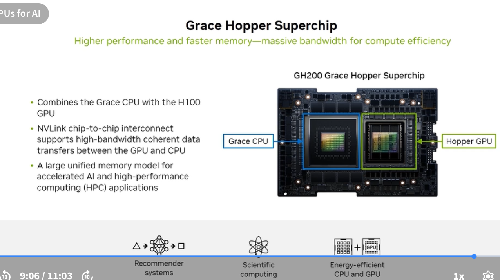
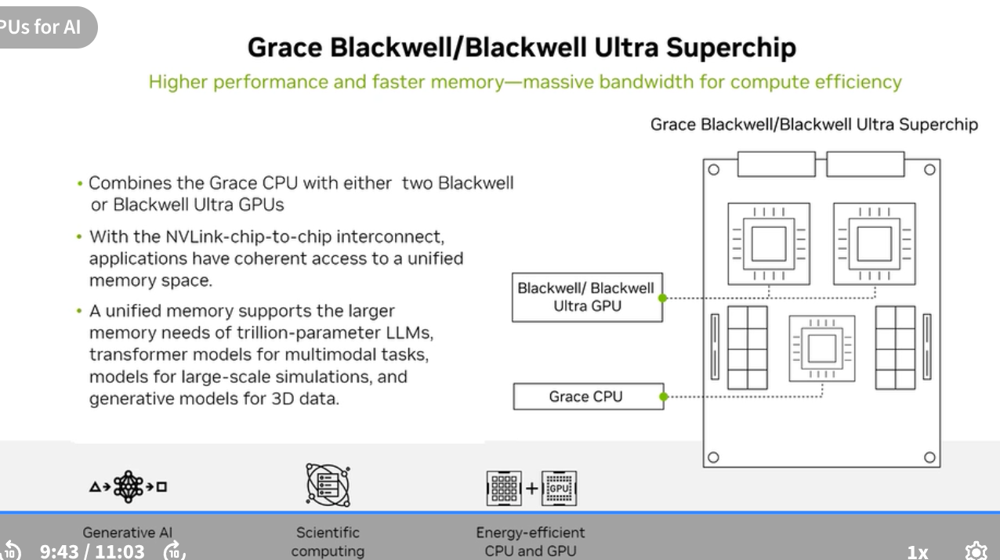
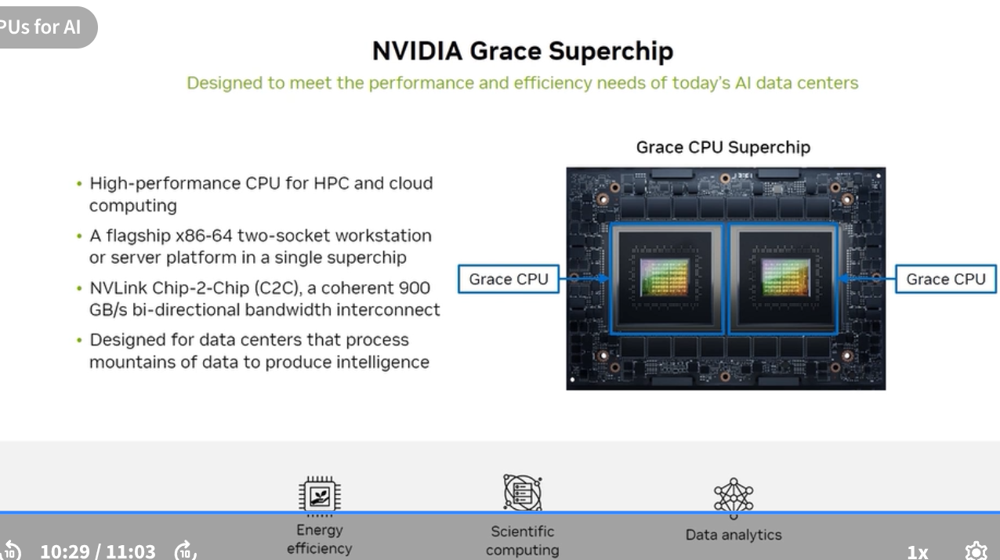

# NVIDIA Superchips

Superchips combine a Grace CPU with one or more GPU dies using **NVLink-C2C** — a chip-to-chip interconnect that provides coherent, high-bandwidth CPU↔GPU memory access far beyond what PCIe allows.

---

## NVLink-C2C: What makes a Superchip

Standard servers: CPU and GPU communicate via PCIe (~64 GB/s). This creates a memory copy bottleneck — data moves slowly between CPU and GPU memory.

Superchip via NVLink-C2C:
- CPU and GPU share a **coherent memory address space** — software sees one unified pool
- Applications can access GPU memory from CPU and vice versa without explicit copy operations
- Bandwidth: NVLink-C2C provides 900 GB/s (GH200) to 1.8 TB/s (GB300) — 10–25× faster than PCIe

---

## GH200 Grace Hopper Superchip

**Combines:** Grace CPU + H100 GPU via NVLink-C2C

| Feature | Value |
|---|---|
| GPU | NVIDIA H100 SXM (80 GB HBM3 or 96 GB HBM3e) |
| CPU | NVIDIA Grace (72-core Arm) |
| GPU Memory | 96 GB HBM3e |
| CPU Memory | 624 GB LPDDR5X |
| NVLink-C2C BW | 900 GB/s bidirectional |
| Key use | AI training, HPC, scientific computing requiring large unified memory |

**Primary workloads:** Scientific AI applications that blend large memory access patterns with GPU compute — computational fluid dynamics, molecular dynamics, genomics, LLM fine-tuning with large context windows.

---

## GB200 Grace Blackwell Superchip

**Combines:** Grace CPU + **two** Blackwell B200 GPUs via NVLink-C2C

| Feature | Value |
|---|---|
| GPUs | 2× NVIDIA Blackwell B200 |
| CPU | NVIDIA Grace (72-core Arm) |
| GPU Memory | ~384 GB HBM3e (2× B200) |
| CPU Memory | LPDDR5X |
| NVLink-C2C | 2nd generation |
| Key capability | Applications have coherent access to unified memory across both GPUs and CPU |

**Primary workloads:** Generative AI at scale, scientific multi-task simulation, energy-efficient transformer-based models for 3D data.

---

## Grace Superchip

**Combines:** Two Grace CPU dies via NVLink-C2C (CPU-only superchip)

| Feature | Value |
|---|---|
| CPUs | 2× Grace (2× 72 = 144 Arm cores) |
| Interconnect | NVLink Chip-2-Chip (C2C), 900 GB/s bidirectional |
| Memory | LPDDR5X (large bandwidth) |
| TDP | Designed for energy-efficient HPC |
| Form factor | Flagship x86-64 workstation or server platform replacement |

**Primary use:**
- High-performance CPU for data centers that process mountains of data
- Energy-efficient computing — designed for cloud and hyperscale
- Scientific computing and data analytics (without GPU)
- Serves as the CPU building block in GB200/GB300 Superchip systems

---

## Superchip comparison

| | GH200 | GB200 | Grace Superchip |
|---|---|---|---|
| CPU | 1× Grace | 1× Grace | 2× Grace |
| GPU | 1× H100 | 2× B200 | None |
| GPU Memory | 96 GB | ~384 GB | — |
| CPU Memory | 624 GB LPDDR5X | LPDDR5X | LPDDR5X |
| NVLink-C2C gen | 1st | 2nd | 1st |
| Key differentiator | Large unified memory for AI/HPC | Maximum Blackwell AI compute | Pure CPU, energy-efficient HPC |
